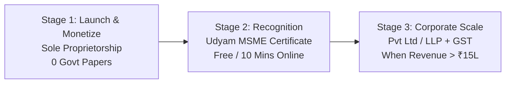
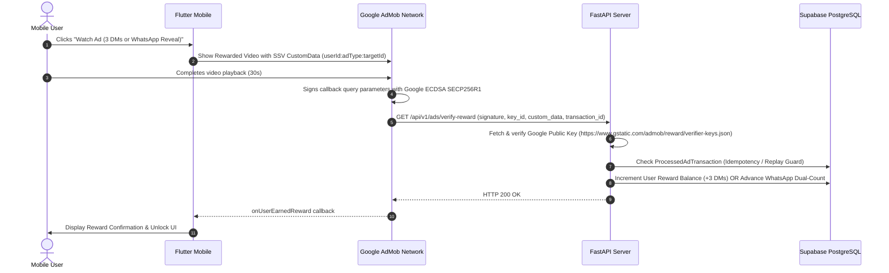

# ASI Verticals: Legal Roadmap, AdMob Monetization & Zero-Blocker Launch Guide

**Document ID:** DOC-LEGAL-ADMOB-012  
**Parent Entity / Brand:** ASI Verticals  
**Product:** UR-Heart  
**Authoritative Reference:** DPDP Act 2023, CGST Act 2017, Google AdMob Program Policies, Google Play Developer Distribution Agreement  

---

## 1. Executive Summary: The "Zero-Paperwork" Reality

> [!IMPORTANT]
> **You DO NOT need a registered Private Limited Company or LLP to launch UR-Heart or earn AdMob revenue today.**
> Google Play Console, Google AdMob, Firebase, Supabase, and Render all fully support **Individual / Sole Proprietorship accounts**. You can launch, monetize, and scale to thousands of users immediately using your personal PAN, Aadhaar, and Bank Account while using **"ASI Verticals"** as your public brand / trade name.

---

## 2. Staged Legal Evolution Roadmap



### Stage 1: Individual / Sole Proprietor (Current Phase — ZERO Friction)
* **Legal Entity:** Sole Proprietorship (Under your name trading as "ASI Verticals").
* **PAN:** Personal PAN Card (In India, a sole proprietor and the individual have the same legal identity and tax identity).
* **Bank Account:** Your existing Savings or Individual Current Account.
* **GST Requirement:** **EXEMPT**. Under Section 22 of the CGST Act, 2017, service providers whose aggregate turnover in a financial year does not exceed **₹20,00,000 (₹20 Lakhs)** are legally exempt from GST registration.
* **Google Play Account:** **Individual Developer Account**. You provide your Government ID (Aadhaar / Passport / Voter ID) for Google Play identity verification. Your public Developer Name can be set to **"ASI Verticals"**.
* **Google AdMob Account:** **Individual AdMob Account**. Connect your personal PAN and bank account for international wire transfer payouts (USD to INR auto-converted by your bank).

---

### Stage 2: Free Government MSME Recognition (10 Minutes, ₹0 Cost)
* **Portal:** Official Government of India Portal: `udyamregistration.gov.in`
* **Requirements:** Aadhaar Number + PAN Card.
* **Cost:** ₹0 (Completely free; avoid middleman agents).
* **Enterprise Name:** Register as **"ASI Verticals"** under Major Activity: *Services -> Software & Mobile App Publishing (NIC Code 58200 / 62011)*.
* **Benefits:**
  1. Instant official Government Certificate with **Udyam Registration Number (URN)**.
  2. Legal proof that "ASI Verticals" is a recognized business enterprise owned by you.
  3. Eligible to open a **Business Current Account** in the name of "ASI Verticals" at any bank (HDFC, ICICI, SBI, Axis) if you want business-named banking before incorporation.
  4. Priority sector lending and trademark fee subsidies (50% discount on Trademark registration).

---

### Stage 3: Corporate Incorporation (When Annual Revenue Reaches ₹15–20 Lakhs)
* Once UR-Heart reaches consistent traction, monthly recurring revenue, or seeks external equity investment:
  * Incorporate **"ASI Verticals Private Limited"** or **"ASI Verticals Technologies LLP"** via the MCA SPICe+ portal.
  * Register for GSTIN and Corporate PAN/TAN.
  * Upgrade Google Play Console and AdMob accounts to an **Organization Account** using the Certificate of Incorporation (COI) without app downtime or lost rankings.

---

## 3. Google AdMob Production Best Practices

### 3.1. Avoiding the #1 Fatal Mistake: "Invalid Traffic / Self-Clicking Ban"
Google's automated risk algorithms permanently terminate AdMob accounts if developers or internal testers watch live production ads on their own devices.

#### The Mandatory Safeguards:
1. **Never Click or Watch Live Ads During Development:**
   * Keep default ad unit IDs set to Google's official Sample Ad Unit IDs during development:
     * Rewarded Video: `ca-app-pub-3940256099942544/5224354917`
     * Interstitial: `ca-app-pub-3940256099942544/1033173712`
2. **Register Physical Test Devices in Code:**
   * In `mobile/lib/core/config/env_config.dart`, add your phone's AdMob Device ID to `admobTestDeviceIds`. When you run the app, the Android logcat prints:
     ```
     I/Ads: Use RequestConfiguration.Builder().setTestDeviceIds(Arrays.asList("33BE2250B43518CC672E42E25002D0E4"))
     ```
   * Register this string in `EnvConfig.admobTestDeviceIds` so Google delivers test watermarked ads to your physical phone even when production unit IDs are active.
3. **Environment Injection at Build Time:**
   * When building the production `.aab` for Google Play Store, inject your live AdMob IDs via Dart compile-time environment flags:
     ```bash
     flutter build appbundle --release \
       --dart-define=ADMOB_REWARDED_UNIT_ID="ca-app-pub-XXXXXXXXXXXXX/YYYYYYYYYY" \
       --dart-define=ADMOB_INTERSTITIAL_UNIT_ID="ca-app-pub-XXXXXXXXXXXXX/ZZZZZZZZZZ"
     ```

---

## 4. Server-Side Verification (SSV) Architecture

Google AdMob SSV ensures that users cannot tamper with client-side code or fake rewards. The flow operates as follows:



### 4.1. AdMob Console SSV Setup Step-by-Step
1. Log in to [AdMob Console](https://admob.google.com).
2. Navigate to **Apps** -> **UR-Heart** -> **Ad units** -> Click on your **Rewarded Ad Unit**.
3. Expand **Advanced settings** -> Check **Server-side verification (SSV)**.
4. Set **Callback URL**:
   ```
   https://ur-heart.onrender.com/api/v1/ads/verify-reward
   ```
5. Leave **Custom parameters** blank (the Flutter mobile client automatically passes the `{userId}:{adType}:{targetId}` payload dynamically via `setServerSideOptions`).
6. Click **Save**.

---

## 5. Summary Checklist for Immediate Execution

| Step | Action | Paperwork Required? | Status |
|---|---|---|---|
| **1** | Build & Test AdMob code with test unit IDs | None | **Done & Verified** |
| **2** | Create Google Play Developer Account (Individual) | Personal Aadhaar / PAN | Immediate |
| **3** | Create Google AdMob Account (Individual) | Personal PAN & Bank Account | Immediate |
| **4** | Configure AdMob SSV URL in AdMob Console | None (`ur-heart.onrender.com`) | 2 minutes |
| **5** | (Optional) Register Udyam MSME for "ASI Verticals" | Aadhaar + PAN online | 10 minutes (Free) |
| **6** | Deploy production release `.aab` | None | Ready for Goal H |
