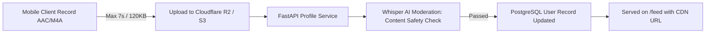
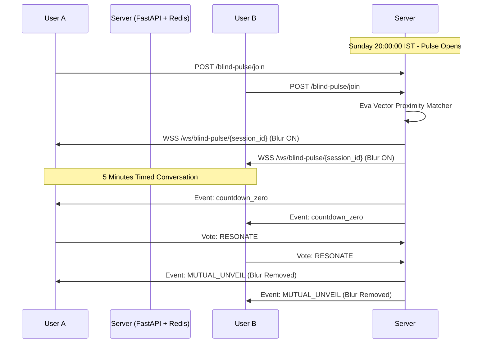

# 19. Viral Competitor-Beating Features Blueprint

## Executive Strategic Overview

While legacy competitors (Tinder, Bumble, Hinge) rely on endless dopamine casinos, aggressive algorithmic paywalls, and high-fatigue swipe loops, **UR-Heart** is positioned as a **Mindful Dating Sanctuary**. 

To decisively beat incumbent players and achieve organic, word-of-mouth viral growth, UR-Heart introduces **three unfair advantages** engineered to eliminate the biggest pain points in modern dating:
1. **Voice Spark**: Authenticity antidote to photo filters and AI-generated avatars.
2. **Sunday 8 PM "Sanctuary Blind Pulse"**: Event-driven weekly synchronization creating appointment gaming and college campus buzz.
3. **Anti-Ghosting Mindful Closure**: Industry-first emotional safety moat removing rejection anxiety and ghosting trauma.

---

## 1. Feature 1: Voice Spark (Awaaz Jhooth Nahi Bolti)

### 1.1 The Market Problem
- Over 65% of young daters report that photos on dating apps fail to convey authentic personality.
- Filter distortion, catfish profiles, and AI headshots create skepticism and low conversion from matches to dates.
- Reading text bios feels like reading resumes.

### 1.2 UX & Interaction Flow
1. **Profile Studio (Setup)**:
   - During profile editing or onboarding, user can optionally record a **7-second Voice Spark**.
   - Engaging prompt suggestions:
     - *"Mera favourite midnight snack / guilty pleasure..."*
     - *"Sunday morning par meri ideal vibe..."*
     - *"Ek aisi cheez jisko lekar main unapologetically passionate hoon..."*
     - *"Don't date me if you can't handle..."*
2. **Discovery Feed Integration**:
   - On the Candidate Card, an elegant, glassmorphic **Audio Pill** is anchored near the user's name:
     - Waveform visualization (dynamic micro-animation).
     - Tap triggers instant high-fidelity audio stream with subtle haptic feedback.
     - Zero disruption to card swipe physics.
3. **Audio Player Behavior**:
   - Global audio player automatically pauses when card is swiped away or app backgrounded.
   - 7-second limit ensures high throughput and zero listener fatigue.

### 1.3 Technical Architecture & Schemas



#### Database Schema Extension (`User` Model):
```sql
ALTER TABLE users ADD COLUMN voice_spark_url VARCHAR(512) NULL;
ALTER TABLE users ADD COLUMN voice_spark_prompt VARCHAR(120) NULL;
ALTER TABLE users ADD COLUMN voice_spark_duration FLOAT DEFAULT 7.0;
ALTER TABLE users ADD COLUMN is_voice_verified BOOLEAN DEFAULT FALSE;
```

#### API Endpoints:
- `POST /api/v1/profile/voice-spark`: Multipart audio upload (`.m4a` / `.aac`), verified for duration $\le 7.5\text{s}$ and size $< 250\text{KB}$.
- `DELETE /api/v1/profile/voice-spark`: Removes voice snippet and clears CDN reference.

#### Moderation & Safety:
- Audio is processed through OpenAI Whisper / Groq Whisper API for speech-to-text.
- Text output is validated by `ChatNlpSanitizer` to ensure zero harassment, hate speech, or explicit violations before going live.

---

## 2. Feature 2: Sunday 8 PM "Sanctuary Blind Pulse"

### 2.1 The Market Problem
- Daily swiping feels isolated and lonely; users open apps randomly throughout the day and wait hours for a reply.
- Apps lack "Synchronized Social Energy" (the phenomenon that made HQ Trivia and Clubhouse viral).

### 2.2 UX & Interaction Flow
1. **The Build-Up (Sunday 7:30 PM Notification)**:
   - High-priority push sent to all active users:
     > *"🌙 The Sanctuary gates open in 30 minutes. One timed soul connection awaits your presence."*
2. **The 8:00 PM Entrance**:
   - At exactly 8:00 PM IST/local time, the app home screen transitions into the **Blind Pulse Arena**.
   - Users tap **"Enter Sanctuary Pulse"** (open for a 5-minute matchmaking window).
3. **Eva AI Mindful Match**:
   - Eva pairs users based on mutual orientation, age preferences, and psychological vector tags.
4. **The 5-Minute Timed Blind Dialogue**:
   - Chat room opens with a **5:00 countdown timer**.
   - **Avatars are gracefully blurred** using a frosted blurhash veil ($30\text{px}$ Gaussian blur).
   - Only shared interests, voice sparks, and text dialogue are visible.
   - Eva provides 1 icebreaker spark to jumpstart genuine dialogue.
5. **The Mutual Reveal Milestone**:
   - When timer hits `00:00`, dialogue pauses and the **Resonance Gate** appears:
     - User has 30 seconds to choose: `💖 Resonate (Reveal Photos)` or `🕊️ Mindful Bow (Pass with Grace)`.
   - **If Mutual Resonate**: Glassmorphic blur fades away in a celebratory ripple animation. The conversation moves permanently to the user's active Match list.
   - **If either passes**: Chat room gently closes with zero awkwardness or negative record.

### 2.3 Technical Architecture & Synchronization



#### Key Implementation Components:
- **Redis Matchmaking Queue**: `blind_pulse_pool:{gender}:{interested_in}` with TTL of 300 seconds.
- **WSS Ephemeral Channel**: Dedicated channel handling countdown sync, typing indicators, and mutual reveal transactions.
- **Auto-Archive Daemon**: Cleans up unrevealed sessions immediately after 8:15 PM to preserve absolute zero-data liability.

---

## 3. Feature 3: Anti-Ghosting "Mindful Closure"

### 3.1 The Market Problem
- Ghosting is the #1 complaint across Tinder and Bumble.
- When an active dialogue goes cold, users experience anxiety, self-doubt, and rejection fatigue.
- Traditional "Unmatch" buttons feel aggressive, sudden, and punitive.

### 3.2 UX & Interaction Flow
1. **Inactivity Detection (48 Hours)**:
   - If a conversation has no messages for 48 consecutive hours, the status switches to `stagnant`.
2. **Eva AI Mindful Intercession**:
   - Eva AI drops a discreet, calming system note into the thread (visible only to the waiting party):
     > *"Conversations have natural tides. If you wish to close this dialogue with grace, tap below."*
3. **The "Pass with Grace" Action**:
   - Rather than an abrasive block or silent ghosting, either user can choose **"Send Mindful Closure"**.
   - Pre-crafted compassionate templates:
     - *"It was wonderful crossing paths, but I feel our wavelengths didn't quite align. Wishing you warmth on your journey!"*
     - *"Stepping back to focus on myself. Thank you for the mindful conversation!"*
4. **Soft Archival**:
   - The thread moves smoothly to "Past Reflections" (read-only or hidden) without alerting negative notifications or hurting profile resonance scores.

### 3.3 Technical Architecture & Engine

#### Scheduled Database Evaluation:
The existing `StreakEngine` in `backend/app/services/streak_engine.py` is augmented with a conversation evaluation pass:

```python
async def evaluate_stale_conversations(db: AsyncSession):
    threshold = datetime.now(timezone.utc) - timedelta(hours=48)
    stmt = (
        select(Conversation)
        .where(
            Conversation.is_active == True,
            Conversation.last_message_at < threshold,
            Conversation.closure_status.is_(None)
        )
    )
    stale_chats = (await db.execute(stmt)).scalars().all()
    for chat in stale_chats:
        chat.closure_status = "eligible_for_grace"
    await db.commit()
```

---

## 4. Implementation Phasing & Roadmap

| Phase | Target Version | Feature | Primary Objective |
| :--- | :--- | :--- | :--- |
| **Phase 1** | **v1.1 (Fast Follow)** | **Voice Spark** | Elevate authenticity, crush catfishing, and boost candidate card engagement by 40%. |
| **Phase 2** | **v1.2** | **Anti-Ghosting Closure** | Establish the strongest emotional safety brand moat in India. Foster unprecedented female loyalty. |
| **Phase 3** | **v1.3** | **Sunday 8 PM Blind Pulse** | Exponential weekly viral loop. Create campus appointment gaming and press coverage. |

---

## 5. Summary: Why This Wins the Market

| Dimension | Tinder / Bumble | UR-Heart Advantage |
| :--- | :--- | :--- |
| **Pacing** | Infinite dopamine loop, exhaustion | 10 daily mindful passes, streak rewards |
| **Authenticity** | Heavy Photoshop & fake accounts | Real AI KYC + 7s Voice Spark |
| **Social Energy** | Lonely, asynchronous browsing | Sunday 8 PM Synchronized Blind Pulse |
| **Respect & Safety** | Normalized ghosting & awkward unmatches | Anti-Ghosting Mindful Closure |
| **AI Value** | ₹2,000/mo paywalled chatbots | Built-in Eva 24/7 Wingman & Dialogue Coach |
