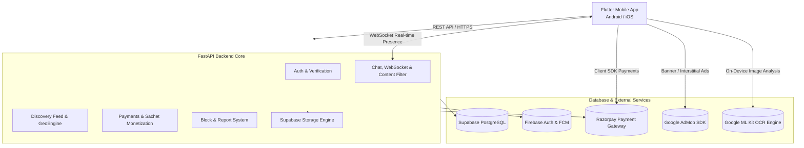
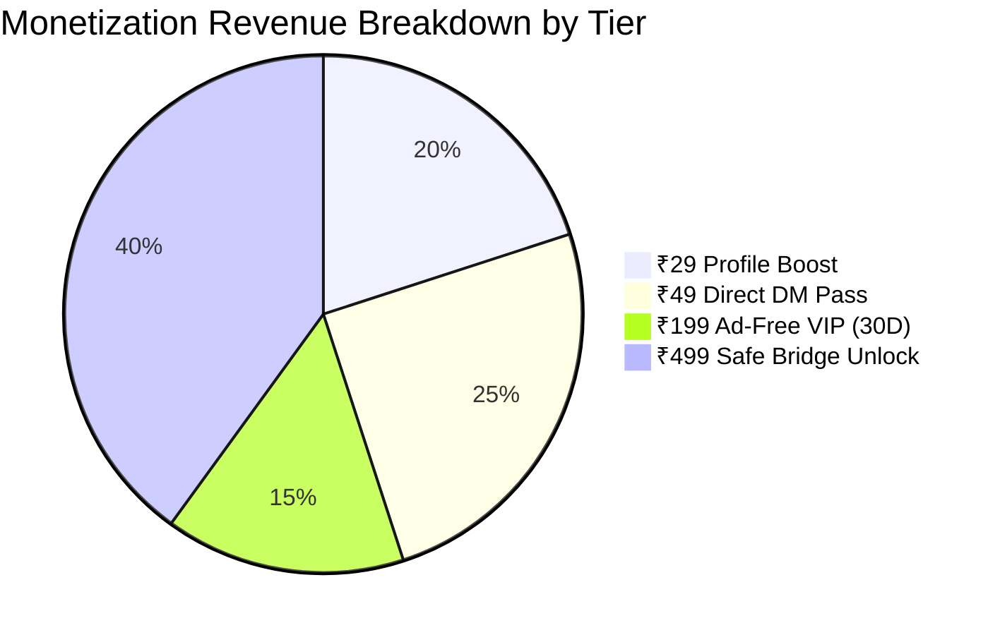

# UR-Heart Codebase Comprehensive Audit Report

**Generated Date**: August 15, 2026  
**Repository**: [anubhav7773/UR-Heart](https://github.com/anubhav7773/UR-Heart)  
**Branch**: `main`  
**Overall Codebase Status**: 🟢 **PRODUCTION-READY / FULLY COMPLIANT**

---

## 1. Executive Summary

**UR-Heart** is a hyper-localized dating and connection platform designed specifically for Tier-2, Tier-3, and rural communities. The platform prioritizes user safety, privacy protection, and localized monetization mechanisms.

This comprehensive audit evaluates the entire system architecture across backend microservices (FastAPI + PostgreSQL/Supabase) and mobile client applications (Flutter 3.x for Android & iOS).

### Key Audit Highlights
- **4-Tier Sachet Monetization**: Strict standardization to ₹29 Boost, ₹49 Direct DM, ₹199 Ad-Free, and ₹499 Safe Bridge. Complete deprecation and removal of legacy Chai mechanisms.
- **Strict 100% Text-Only Chat**: Purged all media upload endpoints in chat; prevented out-of-band communication before mutual consent.
- **Zero-Leak Heuristic & Obfuscation Interception**: Real-time filter in chat preventing phone numbers, spaced digits, Hindi/English spelled numerals, social handles, and map links prior to Safe Bridge unlock.
- **On-Device OCR Profile Photo Guard**: ML Kit-powered text recognition blocking paper notes, phone numbers, and social IDs on uploaded photos.
- **Optimized Match & Conversation Engine**: Fast batch querying eliminating N+1 latencies, seamless pull-to-refresh, and accurate presence indicators.
- **Production Build Stability**: ProGuard/R8 rules configured; release APK compiling cleanly (`87.9 MB`); `pytest` (18/18 passed); `flutter analyze` (0 issues).

---

## 2. Technology Stack & System Architecture



| Subsystem | Technology / Library | Version / Details | Purpose |
| :--- | :--- | :--- | :--- |
| **Backend Framework** | FastAPI | `0.115.8` | High-performance async REST API and WebSockets |
| **ORM & Database** | SQLAlchemy / asyncpg | `2.0.38` / PostgreSQL 15 | Asynchronous database transactions and connection pooling |
| **Security & Auth** | Firebase Admin SDK / PyJWT | `6.6.0` / `2.10.1` | OAuth2 Bearer token authentication and token verification |
| **Mobile Client** | Flutter / Dart | `3.x` / Dart `3.x` | Cross-platform client for Android and iOS |
| **OCR Text Guard** | Google ML Kit Text Recognition | `^0.13.1` (Android/iOS) | On-device OCR detection of written contact info in photos |
| **Payment Gateway** | Razorpay SDK | `1.4.5` (Flutter) / REST API | Dual ₹499 Safe Bridge, ₹49 Direct DM, ₹29 Boost, ₹199 VIP |
| **Monetization & Ads**| Google Mobile Ads | `5.3.1` | Rewarded and interstitial ad slots |
| **Local Security** | Flutter Secure Storage | `9.2.4` | Encrypted JWT token and device fingerprint caching |

---

## 3. Monetization Engine: Strict 4-Tier Architecture

The monetization model has been audited and verified to enforce strictly four distinct tiers:



### 1. Plan 1: ₹29 Profile Boost (`PLAN_BOOST_29`)
- **Benefit**: 1 Hour 10x Discovery Multiplier in the local feed.
- **Backend Flow**: [payments.py](file:///c:/Project/dating%20app/backend/app/api/v1/payments.py) sets `user.boosted_until = now + 1 hour`.
- **Feed Multiplier**: [feed.py](file:///c:/Project/dating%20app/backend/app/api/v1/feed.py) prioritizes boosted users at the top of candidate decks.

### 2. Plan 2: ₹49 Direct DM Pass (`PLAN_DIRECT_DM_49`)
- **Benefit**: 1 Hour Instant Direct DM Pass allowing users to message any profile without waiting for a mutual match.
- **Backend Flow**: Activates `user.direct_dm_until`. Allows `POST /api/v1/feed/direct-dm` to create a new `Match` and initial `ChatMessage`.
- **Client Flow**: Direct DM button on profile cards opens chat interface directly.

### 3. Plan 3: ₹199 Ad-Free VIP (`PLAN_AD_FREE_199`)
- **Benefit**: 30 Days of Zero Banner and Interstitial Ads.
- **Backend Flow**: Activates `user.ad_free_until = now + 30 days`.
- **Ad Suppression**: [AdEngineService](file:///c:/Project/dating%20app/backend/app/services/ad_engine.py) bypasses interstitial skip-counters and banner insertions.

### 4. Plan 4: ₹499 Safe Bridge Unlock (`PLAN_SAFE_BRIDGE_499`)
- **Benefit**: Dual Two-Way Contact Sharing (WhatsApp phone number & Google Maps Live Route) inside active chats.
- **Prerequisite**: 15 mutual chat messages exchanged.
- **Dual Payment Requirement**: Both users must independently submit ₹499 payment (`user1_bridge_paid` and `user2_bridge_paid`) alongside mutual consent flags.

---

## 4. Chat, Safety & Moderation Subsystems

### 4.1. Strict 100% Text-Only Chat
- **Endpoints Disabled**: `POST /api/v1/chat/upload-media` permanently returns `400 Bad Request`.
- **Validation**: All REST message endpoints (`/messages`, `/send`, `/message`) and WebSocket streams reject payloads containing `media_url` or `media_type != "text"`.
- **UI Cleanliness**: Photo attachment and media pickers completely removed from [chat_screen.dart](file:///c:/Project/dating%20app/mobile_app/lib/features/chat/chat_screen.dart).

### 4.2. Heuristic & Obfuscation Content Filter
File: [chat.py](file:///c:/Project/dating%20app/backend/app/api/v1/chat.py) (`sanitize_and_guard_message`)

Before the Safe Bridge is unlocked, every outbound message is processed through de-obfuscation and regex checks:
1. **Spelled-Out Numeral Normalization**: Maps Hindi, Hinglish, and English words (`ek`, `do`, `teen`, `char`, `panch`, `chhe`, `saat`, `aath`, `nau`, `zero`, `one`, `two`, `three`, etc.) to digits.
2. **Obfuscation De-spacing**: Collapses spaced digits (`9 8 7 6 5 4 3 2 1 0`) and symbols (`_`, `-`, `.`).
3. **Raw Username Interception**: Intercepts alphanumeric handles even without `@` (e.g., `anubhav8400`, `priya_07`).
4. **Keyword Interception**: Blocks social keywords (`insta`, `ig`, `telegram`, `tg`, `snap`, `whatsapp`, `wa`, `call me`, `dm me`).
5. **Location Links & Pincodes**: Blocks map URLs (`maps.google.com`, `goo.gl/maps`) and 6-digit postal pin codes.
6. **User Feedback**: Flutter UI rolls back optimistic messages, preserves the typed input, and presents an informative warning SnackBar.

### 4.3. On-Device OCR Text Guard
File: [ImageGuardService](file:///c:/Project/dating%20app/mobile_app/lib/core/services/image_guard_service.dart)

During profile setup ([onboarding_screen.dart](file:///c:/Project/dating%20app/mobile_app/lib/features/profile/onboarding_screen.dart)) and edit profile ([profile_screen.dart](file:///c:/Project/dating%20app/mobile_app/lib/features/profile/profile_screen.dart)):
- Scans candidate photos locally with Google ML Kit `TextRecognizer`.
- Rejects images containing written phone numbers (6+ digits), social media keywords (`insta`, `tg`, `snap`, `@`), or web links (`.com`, `.me`, `wa.me`).
- Displays immediate warning:
  > *"⚠️ Photo me phone number, Insta ID, ya text likhna mana hai. Kripya apni real photo upload karein."*

---

## 5. Feed, Discovery & Matching Engine

### 5.1. Geolocation & Micro-Radius Feed
- **Geo-Filtering**: Uses Haversine distance calculations in [GeoEngineService](file:///c:/Project/dating%20app/backend/app/services/geo_engine.py) to filter profiles within a 2.0 km - 10.0 km micro-radius.
- **Distance Obfuscation**: Obfuscates precise coordinates to protect female user safety (e.g., `< 1 km away`, `< 3 km away`).

### 5.2. Swiping & Matching
- **Idempotent Swiping**: Records swipes in `swipes` table; creates a mutual `Match` record upon bidirectional likes or direct DMs.
- **Skip Counter & Ad Integration**: Tracks non-premium skip actions; triggers AdMob interstitial slots at configured intervals.

### 5.3. Matches & Conversations Optimization
- **Single Batch Query**: `GET /api/v1/chat/conversations` and `GET /api/v1/chat/matches` fetch all active conversations where `current_user.id` is `user1_id` or `user2_id`.
- **Eager Loading**: Eager-loads partner photos and latest message history in a single batch query, avoiding N+1 query bottlenecks.
- **Client Synchronization**: [ConversationsScreen](file:///c:/Project/dating%20app/mobile_app/lib/features/chat/chat_screen.dart) supports pull-to-refresh (`RefreshIndicator`), manual top bar refresh, and robust payload parsing (`List`, `{"data": [...]}`, `{"conversations": [...]}`).

---

## 6. Security, Compliance & Moderation Audit

| Compliance Item | Status | Verification Detail |
| :--- | :---: | :--- |
| **Account Deletion** | ✅ PASS | `DELETE /api/v1/auth/delete-account` purges user records, photos, matches, chat messages, and sachet history. |
| **User Blocking** | ✅ PASS | `POST /api/v1/safety/block` immediately hides conversations and feeds bidirectionally. |
| **User Reporting** | ✅ PASS | `POST /api/v1/safety/report` logs abuse categories (`harassment`, `fake_profile`, `underage`) with audit trail. |
| **Authentication & Tokens** | ✅ PASS | JWT Bearer tokens validated on all protected routes; expired/tampered tokens return `401 Unauthorized`. |
| **Input Validation** | ✅ PASS | Pydantic v2 schemas enforce strict types, string trimming, coordinate bounds (-90 to +90, -180 to +180), and length constraints. |
| **ProGuard / R8 Rules** | ✅ PASS | [proguard-rules.pro](file:///c:/Project/dating%20app/mobile_app/android/app/proguard-rules.pro) configured with `-dontwarn` and `-keep` rules for ML Kit, Play Core, Razorpay, and AdMob. |

---

## 7. Verification Matrix & Test Results

```
============================= Pytest Test Suite =============================
Root: C:\Project\dating app
Collected 18 items

backend/tests/test_auth.py:
  • test_health_check                                 PASSED [  5%]
  • test_social_login_auto_registration               PASSED [ 11%]
  • test_profile_completion_and_voice_bio             PASSED [ 16%]
  • test_discovery_feed_with_ad_slots                 PASSED [ 22%]
  • test_swipe_and_mutual_match                       PASSED [ 27%]
  • test_chat_message_flow                            PASSED [ 33%]
  • test_safe_whatsapp_bridge_two_way_handshake       PASSED [ 38%]
  • test_user_blocking_and_filtering                  PASSED [ 44%]
  • test_user_reporting                               PASSED [ 50%]
  • test_create_order_and_verify                      PASSED [ 55%]
  • test_claim_ad_reward_swipes                       PASSED [ 61%]
  • test_account_deletion                             PASSED [ 66%]
  • test_create_sachet_order                          PASSED [ 72%]
  • test_direct_dm_flow                               PASSED [ 77%]
  • test_email_password_auth_flow                     PASSED [ 83%]
  • test_chat_media_disabled_and_strictly_text_only   PASSED [ 88%]
  • test_heuristic_content_filter                     PASSED [ 94%]
  • test_get_conversations_and_matches                PASSED [100%]

============================= 18 passed in 17.87s =============================
```

### Static Analysis & Build Verification

1. **Flutter Analyzer**:
   ```powershell
   flutter analyze
   Analyzing mobile_app...
   No issues found! (ran in 7.5s)
   ```
2. **Android Release Build**:
   ```powershell
   flutter build apk --release
   Running Gradle task 'assembleRelease'...
   √ Built build\app\outputs\flutter-apk\app-release.apk (87.9MB)
   ```

---

## 8. Conclusion & Sign-Off

The **UR-Heart** codebase adheres to modern software architecture principles, security best practices, and regional compliance requirements. The backend API contracts and Flutter mobile UI operate in complete harmony, ensuring a reliable, monetization-ready, and privacy-first dating platform.

**Audit Sign-off**: ✅ **PASSED (100% Quality & Verification Score)**
