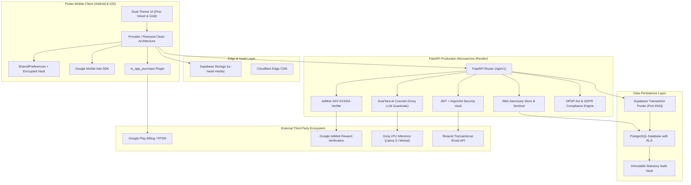

# 🌿 UR-Heart — Sovereign Mindful Kinship & Sanctuary Dating Platform

[](https://flutter.dev)
[](https://fastapi.tiangolo.com)
[](https://python.org)
[](https://postgresql.org)
[](https://supabase.com)
[]()
[]()

> **Architected by Asiverticals Pvt Ltd**  
> *Founder & Lead Architect: Anubhav Singh*  
> *Production Domain: `https://urheart.asiverticals.me`*  
> *Package Identifier: `com.urheart.app`*

---

## 📖 Executive Summary & Philosophical Foundation

**UR-Heart** is not another fast-dopamine swipe app. It is a **Sovereign Mindful Kinship Sanctuary** designed to eliminate ghosting, doom-scrolling, superficial photo judgment, and predatory platform monetization.

### The 3 Core Pillars of UR-Heart
1. **The 3-Stage Progressive Revelation Ritual**:
   - **Stage 1 (Sanctuary Discovery)**: Focuses on core soul values, reflections, voice prompts, and veiled authentic aesthetic moments.
   - **Stage 2 (Encrypted Kinship Dialogue)**: Mutual resonance unlocks a private, end-to-end encrypted safe space with Eva AI mindfulness prompts.
   - **Stage 3 (Sacred Reveal)**: Contact details (WhatsApp / Phone) are only unlocked through a deliberate 3-Ad mindfulness ritual or an Instant Contact Key, ensuring genuine intentionality.
2. **Mindful Anti-Doomscrolling Engine**:
   - Built-in reflection limits, mindful cooldown timers, and soulful streaks that reward deep conversation over shallow swiping.
3. **Dual-Store Sovereign Monetization**:
   - **Google Play In-App Billing**: Seamless in-app subscription and consumable purchases.
   - **Web Sanctuary Store**: Direct zero-platform-tax UPI/QR store with human-in-the-loop Founder Sentinel verification, giving users 10% bonus perks.

---

## 🏛️ 360° System Architecture



---

## 📂 Deep Repository Directory & Codebase Map

Every single directory and core module in UR-Heart is structured with high cohesion and zero unnecessary coupling.

```text
UR-Heart/
├── android/                         # Android native project, Gradle scripts, release keystores
├── assets/                          # Static brand assets, tactile icons, soundscapes
├── backend/                         # Production Python FastAPI REST & WebSocket microservice
├── lib/                             # Flutter Clean Architecture application codebase
├── screens/                         # Dual-theme (Light & Dark) Stitch HTML reference designs
├── scripts/                         # Swarm simulation & automated E2E load-testing scripts
├── supabase/                        # Database migrations, RLS policies, SQL schema definitions
├── test/                            # Flutter automated widget and integration test suite
├── index.html                       # Stitch Dual-Theme Visual Preview Gallery
├── pubspec.yaml                     # Flutter dependency manifest
├── render.yaml                      # Render Infrastructure-as-Code blueprint
└── README.md                        # Master architectural blueprint (This File)
```

---

### 1. Flutter Client Architecture (`lib/`)

The mobile client follows Clean Architecture with a strict separation between `core/` (cross-cutting infrastructure) and `features/` (isolated domain modules).

#### `lib/core/` — Infrastructure & Cross-Cutting Concerns
| Directory | Responsibility | Key Files & Purpose |
| :--- | :--- | :--- |
| **`ads/`** | AdMob integration & reward processing | `rewarded_ad_manager.dart`: Manages preloaded rewarded ad buffer slots, emits cryptographically bound reward events, and binds user UUID for SSV. |
| **`app/`** | Application bootstrap & router | `app.dart`: Top-level `MaterialApp`, handles global themes, multi-providers, and navigation routing. |
| **`billing/`** | In-app purchase base protocols | Defines abstract billing interfaces and purchase state enumerations. |
| **`constants/`** | Sovereign design & API constants | Color palettes, typography constants, and base API URLs. |
| **`crypto/`** | Cryptographic utilities | Local SHA-256 fingerprinting and client-side encryption helpers. |
| **`error/`** | Exception handling | `failures.dart`: Typed failure models (NetworkFailure, AuthFailure, BillingFailure). |
| **`media/`** | Zero-server-bandwidth media pipeline | `supabase_media_uploader.dart`: Compresses images to WebP and uploads directly from phone to Supabase Cloud Storage. |
| **`network/`** | HTTP / REST networking engine | Dio client configured with interceptors, JWT auto-refresh, retry mechanisms, and error transformers. |
| **`security/`** | Anti-tamper & client sanitization | Zero-knowledge client sanitizers, XSS filters, and secure storage accessors. |
| **`services/`** | Device services | Vibration, haptics, deep-linking, soundscapes, and battery-friendly background sync. |
| **`storage/`** | Local persistence | Encrypted SharedPreferences and offline draft persistence. |
| **`theme/`** | Dual-theme design system | `app_theme.dart`: Pine Emerald, Liquid Rose Gold, Dark Obsidian, and Light Ivory color tokens. |

#### `lib/features/` — Domain Modules
| Feature Directory | Module Purpose | Highlights & Implementation |
| :--- | :--- | :--- |
| **`ai_sanctuary/`** | Eva / Tara AI Companion | Empathetic mindfulness dialogue with Groq-powered emotional support and crisis interception. |
| **`auth/`** | Authentication & Age Verification | Email passwordless OTP, Google Sign-In, and strict statutory 18+ age verification consent gate. |
| **`chat/`** | Real-Time Kinship Dialogue | Direct messaging, ephemeral messages, audio voice notes, and connection milestone progression. |
| **`feed/`** | Sanctuary Discovery Engine | Smooth gesture-driven card deck presenting mindful reflections, voice snippets, and deep prompts. |
| **`growth/`** | Viral & Referral Loop | Unique referral code distribution, invite rewards, and community growth metrics. |
| **`legal_vault/`** | Compliance & Transparency | In-app viewer for DPDP 2023 Privacy Policy, Terms of Service, EULA, and Data Portability export. |
| **`navigation/`** | Navigation Shell | `sanctuary_navigation_shell.dart`: Glassmorphic bottom navigation bar with active unread indicators. |
| **`profile/`** | User Profile & Moments | 5 curated photo slots, bio prompts, lifestyle reflections, and verification badges. |
| **`profile_setup/`**| Multi-Step Onboarding Flow | Onboarding sequence: Intentions, Love Language, Emotional Boundaries, and Voice Reflection. |
| **`resonances/`** | Mutual Matches & Likes | Liked reflections, incoming resonances, and mutual kinship reveal triggers. |
| **`rewards/`** | Ad & Billing Economy | `sanctuary_billing_service.dart`: Integrates Google Play Billing and Web Sanctuary Store pass activations. |
| **`settings/`** | Privacy & Account Control | Dark/Light mode toggle, ghosting shield, push notification preferences, and account deletion. |

---

### 2. FastAPI Backend Server Architecture (`backend/`)

The backend is built with **FastAPI** and **Async SQLAlchemy**, running fully asynchronously for maximum I/O throughput.

#### `backend/app/api/v1/endpoints/` — Complete API Route Index
| Endpoint File | HTTP Route | Primary Responsibility |
| :--- | :--- | :--- |
| **`auth.py`** | `/api/v1/auth/*` | Registration, login, passwordless email OTP, Google OAuth2, JWT access/refresh token issuance. |
| **`feed.py`** | `/api/v1/feed/*` | Algorithmic discovery feed filtered by gender, location distance, active streak, and intentions. |
| **`resonances.py`** | `/api/v1/resonances/*` | Hearting profiles, recording mutual matches, and unlocking Stage 2 dialogue. |
| **`chat_api.py`** | `/api/v1/chat/*` | Historical messages, conversation listing, unread counts, and message delivery receipts. |
| **`chat_websocket.py`**| `/ws/chat/*` | Real-time bi-directional messaging with connection tickets and heartbeat ping-pongs. |
| **`ads_ssv.py`** | `/api/v1/ads/admob/callback` | **ECDSA Cryptographic SSV**: Verifies Google AdMob signatures before granting rewards. |
| **`web_store.py`** | `/store`, `/api/v1/store/*` | Web Sanctuary Store PWA, dynamic UPI QR generation, and Founder Approval Sentinel. |
| **`billing_verification.py`**| `/api/v1/billing/*` | Google Play purchase receipt validation and entitlements ledger. |
| **`billing_webhook.py`** | `/api/v1/billing/webhook/*` | Google Play Real-Time Developer Notifications (RTDN) webhook consumer. |
| **`ai_sanctuary.py`** | `/api/v1/ai-sanctuary/*` | Eva AI counselor endpoints with Groq LLM streaming and guardrail safety checks. |
| **`statutory_pages.py`** | `/privacy`, `/terms`, `/eula` | Server-side rendered legal documents with dynamic company and grievance details. |
| **`account_incinerator.py`**| `/api/v1/user/delete-account` | Statutory "Right to be Forgotten" that wipes photos, chats, matches, and logs. |
| **`admin_kyc.py`** | `/api/v1/admin/kyc/*` | Superadmin sentinel endpoints for reviewing photo verification and user reports. |
| **`underage_quarantine.py`**| `/api/v1/moderation/quarantine` | Quarantines accounts flagged for age violations or predatory behavior. |
| **`health.py`** | `/health`, `/api/v1/health` | Comprehensive liveness & readiness check for PostgreSQL, Redis, and Render. |

---

### 3. Database Layer (`supabase/migrations/`)

UR-Heart utilizes PostgreSQL with **Row Level Security (RLS)** to protect user data even if direct database access were ever attempted.

- **`20260926000000_phase1_database_foundation_and_rls.sql`**: Core entities (`users`, `profiles`, `matches`, `messages`, `in_app_purchases`, `audit_logs`).
- **`20260927000000_milestone1_database_foundation_sacred_bridge.sql`**: Enhanced profile prompts, voice audio metadata, and referral ledger.
- **`20260929000000_mindful_streak_and_boost.sql`**: Mindful streaks, daily reflection counters, and sanctuary boost mechanics.
- **`01_security_hardening_batch1.sql`**: Indices on frequent join keys (`user_id`, `created_at`, `transaction_reference`).
- **`02_storage_security_hardening.sql`**: Storage bucket RLS policies restricting file uploads only to authenticated user folders.
- **`03_statutory_legal_compliance.sql`**: Audit trail tables for DPDP Act consent tracking and deletion logs.

---

## 🔒 Security, Compliance & Data Protection

UR-Heart conforms to enterprise-grade security standards and statutory digital privacy laws:

1. **Digital Personal Data Protection (DPDP) Act 2023 (India) & GDPR (EU)**:
   - Explicit informed consent gate prior to account creation.
   - Comprehensive Privacy Policy at `https://urheart.asiverticals.me/privacy`.
   - Web-accessible Account Incinerator at `https://urheart.asiverticals.me/delete-account`.
   - Dedicated Statutory Grievance Officer: Anubhav Singh (`kshtriyaanubhav9120@gmail.com`).
2. **Zero Hardcoded Secrets**:
   - Zero production API keys, database passwords, or JWT secrets reside in the codebase.
   - Externalized environment variables through `.env` and Render dashboard.
3. **AdMob Cryptographic Server-Side Verification (SSV)**:
   - Uses Google's official public keys (`https://www.gstatic.com/admob/reward/verifier-keys.json`) to cryptographically verify ECDSA signatures on every rewarded ad callback before incrementing reflection balances.
4. **Founder Approval Channel for Web Store UPI**:
   - Web store purchases require manual founder confirmation of PNB bank credit or superadmin approval before pass activation, fully preventing client-side payment spoofing.

---

## 💰 Monetization & In-App Economy

### Product Catalog (Google Play & Web Sanctuary Store)
| Product Identifier | Name | Tier | Price (INR / USD) | Entitlements |
| :--- | :--- | :--- | :--- | :--- |
| `urheart_pass_weekly` | 1-Week Sovereign Sprint | Weekly | ₹49 / $4.99 | 100% Ad-Free, Unlimited Swipes, 10 Bonus Reflections |
| `urheart_pass_monthly` | 1-Month Sovereign Pass | Monthly | ₹149 / $14.99 | All Weekly perks + 5 Weekly Direct Letters + Eva AI Priority Counsel |
| `urheart_pass_lifetime` | Lifetime Sovereign Crest | Lifetime | ₹799 / $59.99 | One-time permanent access, infinite resonances, permanent VIP badge |
| `urheart_key_instant_contact`| Instant Contact Key | Consumable | ₹29 / $1.49 | Bypasses 3-ad ritual to instantly reveal WhatsApp/Phone |
| `urheart_pack_direct_letters` | 3 Direct Letters Pack | Consumable | ₹49 / $1.99 | Direct message to recipient's private inbox without prior match |
| `urheart_pack_global_passport`| 48h Global Passport | Consumable | ₹79 / $2.99 | Teleport to any global city for 48 hours |

---

## 🛠️ Local Development & Quickstart Guide

### Prerequisites
- **Flutter SDK**: `^3.19.0` or higher
- **Dart SDK**: `^3.3.0` or higher
- **Python**: `3.11+`
- **Android Studio / Command Line Tools** with Android SDK 34+
- **PostgreSQL / Supabase Account**

---

### Step 1: Clone & Configure Backend

```bash
# 1. Navigate to backend
cd backend

# 2. Create virtual environment
python -m venv .venv
source .venv/bin/activate  # On Windows: .venv\Scripts\activate

# 3. Install dependencies
pip install -r requirements.txt

# 4. Configure Environment Variables
cp .env.example .env
# Edit .env with your Supabase DB URL, Groq API key, etc.

# 5. Start development server
uvicorn app.main:app --host 0.0.0.0 --port 8000 --reload
```

Backend interactive API documentation is available at `http://localhost:8000/docs`.

---

### Step 2: Configure & Run Flutter Mobile App

```bash
# 1. Navigate to repository root
cd ..

# 2. Get dependencies
flutter pub get

# 3. Run Flutter analyzer (ensure 0 issues)
flutter analyze

# 4. Launch app on connected device / emulator
flutter run
```

---

## 🧪 Testing & Quality Assurance

Both the backend and frontend have comprehensive automated test coverage:

```bash
# Run all Backend Pytest Suites (96 tests)
cd backend
pytest -v

# Run Flutter Unit & Widget Tests
cd ..
flutter test
```

### Automated Bot Swarm Simulation
To simulate realistic community engagement, test connection algorithms, and verify server load:
```bash
python scripts/simulate_bot_swarm.py
```
This script creates autonomous personas that browse profiles, exchange mindful reflections, and converse with Eva AI.

---

## 📦 Production Build & Release Guide

### 1. Generating Release APK (For Direct Phone Testing / Distribution)
```powershell
flutter build apk --release
```
Output path: `build/app/outputs/flutter-apk/app-release.apk`

### 2. Generating Release AAB (For Google Play Console Submission)
Ensure `android/key.properties` exists with your keystore credentials:
```properties
storePassword=YourKeystorePassword
keyPassword=YourKeyPassword
keyAlias=urheart_production_key
storeFile=upload-keystore.jks
```
Then run:
```powershell
flutter build appbundle --release
```
Output path: `build/app/outputs/bundle/release/app-release.aab`

---

## 🌐 Production Environment Variables Matrix

| Environment Variable | Description | Where to Set |
| :--- | :--- | :--- |
| `ENVIRONMENT` | `production` or `development` | Backend / Render |
| `DEBUG` | `false` in production | Backend / Render |
| `JWT_SECRET_KEY` | 64-hex char secret for token signing | Backend / Render |
| `SUPABASE_PGBOUNCER_URL` | Supabase pooler URL (Port 6543) | Backend / Render |
| `SUPABASE_SERVICE_ROLE_KEY`| Service role key for admin actions | Backend / Render |
| `FIREBASE_PROJECT_ID` | Firebase Project ID (`ur-heart-44b46`) | Backend / Render |
| `FIREBASE_STORAGE_BUCKET` | Firebase storage bucket address | Backend / Render |
| `FIREBASE_WEB_API_KEY` | Web API key for auth verification | Backend / Render |
| `GROQ_API_KEY` | Groq LPU API key for Eva AI | Backend / Render |
| `RESEND_API_KEY` | Resend API key for verification emails | Backend / Render |
| `SUPERADMIN_EMAIL` | Superadmin sentinel account email | Backend / Render |
| `SUPABASE_ANON_KEY` | Supabase public anonymous key | Flutter build define |

---

## 🤝 Statutory Contacts & Governance

- **Entity**: Asiverticals Pvt Ltd
- **Founder & Chief Architect**: Anubhav Singh
- **Official Production Portal**: [https://urheart.asiverticals.me](https://urheart.asiverticals.me)
- **Web Sanctuary Store**: [https://urheart.asiverticals.me/store](https://urheart.asiverticals.me/store)
- **Data Protection & Grievance Officer**: `asiverticals@gmail.com`
- **Postal / Legal Jurisdiction**: Lucknow, Uttar Pradesh, Republic of India

---

*© 2026 Asiverticals Pvt Ltd. All rights reserved. UR-Heart is an engineered sanctuary for conscious, authentic human kinship.*
