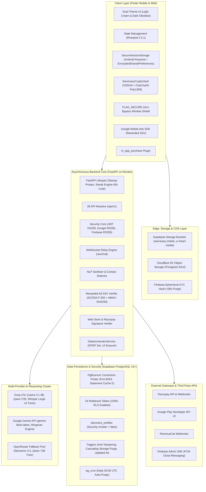
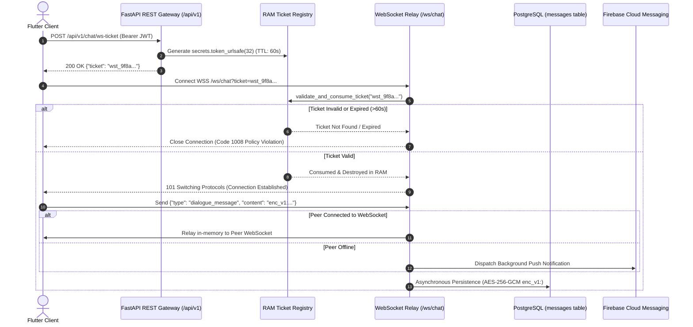

# 🌿 UR-Heart — Sovereign Mindful Kinship & Sanctuary Dating Platform

[](https://flutter.dev)
[](https://fastapi.tiangolo.com)
[](https://python.org)
[](https://postgresql.org)
[](https://supabase.com)
[]()
[]()

> **Architected by Asiverticals Pvt Ltd**  
> *Founder & Lead Architect: Anubhav Singh*  
> *Statutory Legal Jurisdiction: Lucknow, Uttar Pradesh, Republic of India*  
> *Grievance Officer: Anubhav Singh (`asiverticals@gmail.com`)*  
> *Production API Gateway: `https://urheart.asiverticals.me`*  
> *Android Package Identifier: `com.urheart.sanctuary`*

---

## Table of Contents
1. [Section 1: Executive Overview & Core Product Architecture](#section-1-executive-overview--core-product-architecture)
2. [Section 2: Complete Inventory of Currently Existing Features & Exact Runtime Conditions](#section-2-complete-inventory-of-currently-existing-features--exact-runtime-conditions)
3. [Section 3: UI/UX Design System, Themes & Visual Specifications](#section-3-uiux-design-system-themes--visual-specifications)
4. [Section 4: 360° Technical Architecture, API Route Reference & Database Schema](#section-4-360-technical-architecture-api-route-reference--database-schema)
5. [Section 5: Monetization, In-App Economy, Pricing & Ad SSV Mechanics](#section-5-monetization-in-app-economy-pricing--ad-ssv-mechanics)
6. [Section 6: Security Hardening & Statutory Legal Compliance Posture](#section-6-security-hardening--statutory-legal-compliance-posture)
7. [Section 7: Future Roadmap, Upcoming Features & Exact Activation Conditions](#section-7-future-roadmap-upcoming-features--exact-activation-conditions)
8. [Section 8: Local Setup, Environment Configuration & Deployment Blueprint](#section-8-local-setup-environment-configuration--deployment-blueprint)

---

# Section 1: Executive Overview & Core Product Architecture

## 1.1 Philosophical Foundation & Mindful Connection Vision
UR-Heart is engineered as an intentional antithesis to superficial swipe culture, gamified attention extraction, ghosting, and predatory subscription moats. Modern digital dating platforms maximize dopamine loops, encourage disposable interactions, and monetize loneliness through algorithmic scarcity. UR-Heart establishes a **Sovereign Mindful Kinship Sanctuary** centered on conscious presence, verifiable trust, reciprocal consent, and statutory data sovereignty.

### The 3 Core Pillars of UR-Heart
1. **The 3-Stage Progressive Revelation Ritual**:
   - **Stage 1 (Sanctuary Discovery)**: Focuses on core soul values, intentional reflections, audio Voice Sparks, and blurred/veiled moments. Superficial photo evaluation is suppressed; connections initiate on values, orientation reciprocity, and emotional compatibility.
   - **Stage 2 (Encrypted Kinship Dialogue)**: Mutual affinity unlocks a strictly text-only, end-to-end encrypted (E2EE) conversation chamber guided by Eva AI mindfulness sparks. External handle exchanges and contact leaks are blocked by client- and server-side NLP sanitizers.
   - **Stage 3 (Sacred Reveal & Contact Bridge)**: Off-platform contact channels (WhatsApp, Telegram, Instagram) are sealed behind bilateral cryptographic consent. Unsealing requires either a mutual 3-ad mindfulness ritual or an Instant Contact Key, establishing mutual deliberation before off-platform contact.
2. **Mindful Anti-Doomscrolling Engine**:
   - Built-in reflection quotas (10 daily base skips), 24-hour streak preservation with night slumber rest multipliers ($1.5\times$ to $2.0\times$), anti-ghosting Graceful Closure mechanics (`closed_with_grace`), and a 5-minute anonymous Blind Date queue with photo unmasking only upon mutual affinity.
3. **Dual-Channel Sovereign Monetization**:
   - **Google Play In-App Billing**: Direct mobile billing verified server-side against the Google Play Developer API.
   - **Web Sanctuary Store**: Direct web storefront powered by Razorpay India and international corridors, offering **+10% Web Bonus Perks** and guest-checkout entitlement stashing.

---

## 1.2 High-Level System Architecture



---

## 1.3 Technology Stack & Verified Versions

| Layer | Subsystem / Package | Exact Version | Configuration & Technical Bounds |
|---|---|---|---|
| **Mobile & Web Client** | Flutter SDK | `>=3.10.0` | Target platforms: Android (API 26-34), Web PWA. Dart SDK `>=3.0.0 <4.0.0`. |
| | Riverpod | `^2.5.1` | `flutter_riverpod`. `StateNotifier` and providers for all business logic. |
| | Secure Storage | `^9.2.2` | `flutter_secure_storage` with `AndroidOptions(encryptedSharedPreferences: true)`. |
| | Cryptography | `^2.7.0` | Pure-Dart `cryptography`. Asymmetric `X25519`, HKDF-SHA256, `ChaCha20.poly1305Aead`. |
| | Telemetry & Crashlytics | `^9.0.0` | `sentry_flutter`. Sample rate 10%, `sendDefaultPii: false`, DPDP redactions. |
| | Rewarded Ads | `^5.2.0` / `9.1.0` | `google_mobile_ads`. Pre-buffered rewarded video ad slots, SSV custom data. |
| | Mobile Billing | `^3.2.0` | `in_app_purchase`. Google Play In-App Billing with server-side GPA receipt validation. |
| | WebSockets | `^3.0.3` | `web_socket_channel`. Secure WSS transport with 60-second single-use tickets. |
| **Backend Engine** | Python Runtime | `3.11+` | Asynchronous runtime on Render PaaS. Zero Celery/Redis queue (pure native `asyncio`). |
| | FastAPI | `^0.110.0` | Uvicorn ASGI server. Lifespan context manager, 4 global middlewares. |
| | Database Engine | `^2.0.0` | SQLAlchemy Async with `asyncpg`. Connected to Supabase PgBouncer (Port 6543). |
| | Rate Limiting | `^0.1.9` | SlowAPI limiter with IP resolver (`CF-Connecting-IP`, `X-Forwarded-For`). |
| | Authentication | PyJWT & Cryptography | Dual HS256 internal JWTs, RS256 Google One Tap, RS256 Firebase Admin ID tokens. |
| **Database & Persistence**| PostgreSQL | `15+` | Supabase managed instance. PgBouncer transaction mode (`statement_cache_size: 0`). |
| | Tables & Policies | 24 Tables | 100% Row Level Security (RLS) coverage; 0% unauthenticated PostgREST exposure. |
| | Background Maintenance | `pg_cron` | Scheduled daily at 03:00 UTC (`0 3 * * *`) for 30-day message and pass swipe purges. |
| **AI Inference Cluster** | Groq LPU | Enterprise API | Primary text (`llama-3.1-8b-instant`), vision (`qwen/qwen3.8-27b`), STT (`whisper-large-v3-turbo`). |
| | Google AI Studio | Gemini API | `gemini-flash-latest`, `gemini-flash-lite-latest`, `gemini-3-flash-preview` (Wingman Engine). |
| | OpenRouter | Free Pool | Secondary/tertiary failover: `nemotron-3.5-lightning:free`, `qwen-2.5-vl-72b-instruct:free`. |
| **Cloud Storage** | Supabase Storage | S3 / REST | Buckets `sanctuary-media` and `ur-heart-media` (100 KB WebP limit, owner path regex). |
| | Cloudflare R2 | S3 API | Presigned S3v4 `PUT` upload URLs for zero-server-bandwidth offloading. |
| | Firebase Storage | Cloud Bucket | Bucket `ur-heart-44b46.firebasestorage.app` (<60s ephemeral video KYC auto-purge). |

---

# Section 2: Complete Inventory of Currently Existing Features & Exact Runtime Conditions

## 2.1 Core Entry State Machine (`lib/main.dart`)
On application boot, `lib/main.dart` executes a pre-render state machine before committing the first frame:
1. `WidgetsFlutterBinding.ensureInitialized()` initializes the Flutter engine.
2. `Firebase.initializeApp()` binds native platform credentials.
3. `SanctuaryNotificationService.instance.initialize()` registers system tray notification channels.
4. `SecureSessionStorage` checks for `ur_heart_auth_token` and `FirebaseAuth.currentUser`. If Firebase user is present but backend JWT is missing, self-heals by signing out.
5. The state machine evaluates routing in strict sequence:
   - `!isConsentGiven` $\implies$ Route to `/consent`
   - `!hasAuthToken` $\implies$ Route to `/auth`
   - `!isProfileSetupDone` $\implies$ Route to `/profile-setup`
   - Fully Authenticated $\implies$ Route to `/main`

---

## 2.2 Screen-by-Screen Inventory Across All 13 Canonical Screens

```
                                    [App Boot]
                                        │
                                        ▼
                         ┌─────────────────────────────┐
                         │ Screen 01: /consent         │
                         │ (Bilingual DPDP, 3 Checks,  │
                         │  Irrevocable Theme Lock)    │
                         └──────────────┬──────────────┘
                                        │
                                        ▼
                         ┌─────────────────────────────┐
                         │ Screen 02: /auth            │
                         │ (18+ Wheel Gate, Quarantine,│
                         │  Google One Tap / Password) │
                         └──────────────┬──────────────┘
                                        │
                         ┌──────────────┴──────────────┐
                         ▼                             ▼
              [Email / Magic Link]           [Google OAuth Sync]
                         │                             │
                         ▼                             │
          ┌─────────────────────────────┐              │
          │ Screen 03: /verify-email    │              │
          │ (Deep Link Intent, 1.8s     │              │
          │  Polling, 60s Resend Timer) │              │
          └──────────────┬──────────────┘              │
                         │                             │
                         └──────────────┬──────────────┘
                                        │
                                        ▼
                         ┌─────────────────────────────┐
                         │ Screen 04: /profile-setup   │
                         │ (5-Slot WebP, Bio Polish,   │
                         │  6-Tier GPS, 5s Video KYC)  │
                         └──────────────┬──────────────┘
                                        │
                                        ▼
                  ┌───────────────────────────────────────────┐
                  │ Screen 05-13: Sanctuary Navigation Shell  │
                  │ (/main, Tab 0 - Tab 4)                    │
                  └─────────────────────┬─────────────────────┘
         ┌──────────────┬───────────────┼───────────────┬──────────────┐
         ▼              ▼               ▼               ▼              ▼
     [Tab 0]        [Tab 1]          [Tab 2]         [Tab 3]        [Tab 4]
   Screen 05:     Screen 06 & 07:   Screen 08 & 09: Screen 10:    Screen 11, 12, 13:
   Sanctuary Feed Resonances        Chats Hub &     Growth Hub &  My Persona, Vault,
   (/feed)        (/resonances)     Dialogue        Sovereign     Settings
                                    (/chats)        (/growth)     (/persona, /vault,
                                                                   /settings)
```

### Screen 01: Mindful Consent Screen (`/consent`)
- **Widget & Controller**: `ConsentScreen` (`lib/features/auth/presentation/screens/consent_screen.dart`), governed by `ConsentController` (`lib/features/auth/presentation/controllers/consent_controller.dart`).
- **Visual Design Reference**: `screens/dark-mode/01_consent-screen/` and `screens/light-mode/01_consent-screen/`.
- **Runtime Conditions & Business Rules**:
  - Displays bilingual English and Hindi statutory terms in accordance with DPDP Act 2023 Section 6.
  - Requires explicit, unbundled toggling of 3 mandatory checkboxes:
    1. Affirmative 18+ adult age confirmation (`isAgeConfirmed`).
    2. Mindful EULA & Community Respect Covenant (`isEulaAccepted`).
    3. DPDP Act 2023 Statutory Data Processing Agreement (`isDpdpConsented`).
  - Next step button `canProceed` is strictly disabled until all 3 conditions evaluate to `true`.
  - Commits selected theme permanently before proceeding: `lockThemePermanently()` prompts `PermanentThemeLockDialog`, persisting `is_theme_locked = true` in local storage.

### Screen 02: Auth & Age Gate Screen (`/auth`)
- **Widget & Controller**: `AgeGateAuthScreen` (`lib/features/auth/presentation/screens/age_gate_auth_screen.dart`), governed by `AuthController` and `AgeGateController`.
- **Visual Design Reference**: `screens/dark-mode/02_auth-and-age-screen/` and `screens/light-mode/02_auth-and-age-screen/`.
- **Runtime Conditions & Business Rules**:
  - Implements a neutral Cupertino date wheel picker defaulting to January 1, 2000.
  - Calculated Age formula: $\text{Age} = \text{CurrentYear} - \text{DOB.Year} - (\text{CurrentDate} < \text{DOB.MonthDay} ? 1 : 0)$.
  - **Minor Quarantine Trigger**: If $\text{Age} < 18$:
    - Sets `isUnderage = true`, `isQuarantined = true`.
    - Commits `quarantineUntil = now + Duration(days: 180)` to `FlutterSecureStorage` and `SharedPreferences`.
    - Fires background call `POST /api/v1/auth/quarantine-device` with SHA-256 device hardware installation UUID.
    - Locks out the device for 180 days; subsequent app launches abort with a quarantine dialog.
  - If $\text{Age} \ge 18$: Unlocks `Verified Adult ($age y/o)` green badge (`#2EC4B6`).
  - Authentication options: Google One Tap OAuth (`GoogleSignIn` / `FirebaseAuth`) and Email + Password (minimum 6 characters).

### Screen 03: Magic Link Verification Screen (`/verify-email`, `/magic-link`)
- **Widget & Controller**: `MagicLinkScreen` (`lib/features/auth/presentation/screens/magic_link_screen.dart`), governed by `AuthController`.
- **Visual Design Reference**: `screens/dark-mode/03_email-verification/` and `screens/light-mode/03_email-verification/`.
- **Runtime Conditions & Business Rules**:
  - Listens for Android App Links (`https://urheart.asiverticals.me/api/v1/auth/verify?token=...`) and custom URI scheme (`urheart://auth/verify`).
  - Background polling engine runs every 1.8 seconds via `Timer.periodic`, checking `GET /api/v1/auth/verification-status?poll_token=...`.
  - Resend Magic Link button is gated by a 60-second hardware cooldown timer.
  - Magic link tokens expire after 15 minutes. Upon successful verification, exchanges token for a 7-day JWT access token.

### Screen 04: Complete Your Profile Screen (`/profile-setup`)
- **Widget & Controller**: `ProfileSetupScreen` (`lib/features/profile_setup/presentation/screens/profile_setup_screen.dart`), governed by `ProfileSetupController`.
- **Visual Design Reference**: `screens/dark-mode/04_complete-your-profile/` and `screens/light-mode/04_complete-your-profile/`.
- **Runtime Conditions & Business Rules**:
  - **5-Slot WebP Photo Grid**:
    - Slot 1 is the mandatory Primary Anchor Photo.
    - In-memory compression via `MediaCompressor`: 800x1066 resolution, quality 76-78, size $<35\text{ KB}$, EXIF stripped (`keepExif: false`), 32x32 BlurHash generated for placeholder rendering.
  - **Eva AI Bio Polish**: In-line prompt polish utilizing Groq LPU (`llama-3.1-8b-instant`). Preserves authentic intent while elevating clarity.
  - **6-Tier Patal-Lok Hardware GPS Acquisition**:
    - Cascades through: Tier 1 high-accuracy GPS $\to$ Tier 2 Android Fused Location $\to$ Tier 3 cellular network $\to$ Tier 4 last-known cached location $\to$ Tier 5 IP Geolocation Sentinel $\to$ Tier 6 Default Sanctuary (`New Delhi, India`).
    - Rejects mocked/spoofed locations (`position.isMocked == true`).
    - Truncates coordinates to 2 decimal places ($\approx 1.1\text{ km}$ fuzzy radius) under DPDP data minimization rules.
  - **5-Second Gesture Video KYC Liveness**: Prompts user for a 5-second video gesture (look left, look right, or smile). Video is uploaded for Groq Vision analysis and purged in $<60$ seconds.
  - **Encrypted Contact Bridge**: Collects WhatsApp/Telegram handles, encrypted client-side using AES-256-GCM (`enc_v1:`).

### Screen 05: Sanctuary Discovery Feed (`/feed`, Shell Tab 0)
- **Widget & Controller**: `FeedScreen` (`lib/features/feed/presentation/screens/feed_screen.dart`), governed by `FeedController`.
- **Visual Design Reference**: `screens/dark-mode/05_sanctuary-feed/` and `screens/light-mode/05_sanctuary-feed/`.
- **Runtime Conditions & Business Rules**:
  - **60fps Gesture Physics**: Built with `SanctuaryCardDeck`. Card rotates smoothly between $-15^\circ$ and $+15^\circ$: $\theta = (\Delta x / 300.0).clamp(-0.26, 0.26)\text{ rad}$.
  - **Swipe Release Thresholds**: $\Delta x > 100$ (Mindful Like), $\Delta x < -100$ (Mindful Pass), $\Delta y < -100$ (Direct Letter).
  - **Daily Quotas**: Free seekers receive 10 daily skips. When exhausted, triggers `OutOfSwipesAdModal` (allowing reward refill via rewarded ad or VIP pass).
  - **Reciprocal Orientation Shield**: Enforces bi-directional orientation matching via the secure view `public.discovery_profiles`.
  - **Voice Spark Pill**: Plays 30-second audio bio snippets directly within the feed card.
  - **Sacred Photo Veil**: Renders photos masked with BlurHash unless target user has disabled photo veiling or granted mutual unmasking consent.

### Screen 06: Likes & Rewind Screen (`/resonances`, Shell Tab 1, Tab 0 & `/ignored`)
- **Widget & Controller**: `ResonancesScreen` (`lib/features/resonances/presentation/screens/resonances_screen.dart`) and `IgnoredProfilesScreen`.
- **Visual Design Reference**: `screens/dark-mode/06_likes-screen/` and `screens/light-mode/06_likes-screen/`.
- **Runtime Conditions & Business Rules**:
  - Tab 0 ("Liked You"): Renders inbound likes. Profiles are blurred for Free tier users and unblurred for active VIP Pass holders.
  - Pass Rewind Vault (`/ignored`): Displays historical passed profiles. Rewinding a passed profile back into the discovery deck requires an active VIP Pass.

### Screen 07: Matches & Connections (`/resonances`, Shell Tab 1, Tab 1)
- **Widget & Controller**: `ResonancesScreen` (Tab 1 "Mutual Connections"), governed by `ResonancesController`.
- **Visual Design Reference**: `screens/dark-mode/07_matches-and-chat/` and `screens/light-mode/07_matches-and-chat/`.
- **Runtime Conditions & Business Rules**:
  - Populates mutual matches formed when two users reciprocally liked each other or accepted a Direct Letter.
  - Tapping "💬 Chat" initiates an active dialogue thread, transitions the candidate from the matches carousel to the active chat hub, and registers WebSocket routing.

### Screen 08: Chats & Conversations Hub (`/chats`, Shell Tab 2)
- **Widget & Controller**: `ChatsListScreen` (`lib/features/chat/presentation/screens/chats_list_screen.dart`), governed by `ChatsListController`.
- **Visual Design Reference**: `screens/dark-mode/08_chats-and-conversations/` and `screens/light-mode/08_chats-and-conversations/`.
- **Runtime Conditions & Business Rules**:
  - Top carousel displays Recent Sparks (uninitiated matches awaiting first conversation).
  - Active threads render real-time delivery ticks:
    - Single Grey Tick: Message dispatched and stored on server.
    - Double Grey Ticks: Message delivered to recipient device via WebSocket or FCM.
    - Double Cyan Ticks (`#34B7F1`): Message read by recipient.
  - Graceful Closure Status: Threads closed via the mindful closure protocol render a peaceful archived badge (`closed_with_grace`), preventing harassment and ghosting.

### Screen 09: Encrypted Dialogue & Reveal (`/chat-dialogue`)
- **Widget & Controller**: `ChatDialogueScreen` (`lib/features/chat/presentation/screens/chat_dialogue_screen.dart`), governed by `ChatDialogueController`.
- **Visual Design Reference**: `screens/dark-mode/09_tara-dialogue-and-reveal/` and `screens/light-mode/09_tara-dialogue-and-reveal/`.
- **Runtime Conditions & Business Rules**:
  - **End-to-End Encryption**: Asymmetric X25519 key negotiation, HKDF-SHA256 derivation, and ChaCha20-Poly1305 AEAD payload encryption.
  - **Strict Text-Only Input**: Disallows arbitrary file and image uploads in Stage 2 to prevent unsolicited media transmission.
  - **Client-Side NLP Sanitizer**: `NlpChatSanitizer` scans typed text in real time. Blocks 10-digit Indian numbers, transliterated Hindi/English numbers (`zero`...`nine`, `ek`...`nau`), UPI addresses (`@okhdfcbank`, `@paytm`), external links (`wa.me`, `t.me`), and social handles.
  - **Eva Bonding Spark Bar**: Progresses through intimacy stages (Stage 1 to Stage 3) based on meaningful dialogue length and mutual interaction.
  - **3-Ad Enclave Reveal Ritual**: Stage 3 unseals contact handles only when both parties view 3 rewarded reflection ads or one party exercises an Instant Contact Key.

### Screen 10: Growth PRO & Ad Rewards Hub (`/growth`, Shell Tab 3)
- **Widget & Controller**: `GrowthHubScreen` (`lib/features/rewards/presentation/screens/growth_hub_screen.dart`), governed by `GrowthHubController`.
- **Visual Design Reference**: `screens/dark-mode/10_growth-and-ad-rewards/` and `screens/light-mode/10_growth-and-ad-rewards/`.
- **Runtime Conditions & Business Rules**:
  - **Tab 1: Free Mindful Ads**:
    - Rewarded Ad SSV triggers: Quick Reflection (10s), Deep Resonance (20s), Morning Harvest (10-30s).
    - 5-second anti-bot cooldown enforced between ad plays.
    - Night Slumber Sleep Tracker: Multiplies morning ad rewards by $1.5\times$ for $\ge 6$ hours rest, and $2.0\times$ for $\ge 8$ hours rest.
  - **Tab 2: Sovereign Store**:
    - Displays official commercial passes: 1-Week Sprint (₹49), 1-Month Pass (₹149), 1-Year Pass (₹1,499), Instant Contact Key (₹29), Direct Letters Pack (₹49), and 24h Global Passport (₹99).

### Screen 11: My Persona / Seeker Detail (`/persona`, Shell Tab 4 & `/seeker-detail`)
- **Widget & Controller**: `MyPersonaScreen` (`lib/features/profile/presentation/screens/my_persona_screen.dart`) and `SeekerProfileDetailScreen`.
- **Visual Design Reference**: `screens/dark-mode/11_profile-screen/` and `screens/light-mode/11_profile-screen/`.
- **Runtime Conditions & Business Rules**:
  - **Immutable Credentials Card**: Displays permanently locked Date of Birth, verified adult age badge, sexual orientation, and masked contact enclave.
  - **Voice Spark Recorder**: Records 30-second audio self-reflections with live 80ms hardware microphone amplitude visualizer (`-60 dB` to `0 dB`).
  - **Moments Manager**: Allows reordering and updating photo slots 2-5 while protecting the verified Slot 1 anchor photo.
  - **Discovery Preferences**: Sliders bounded strictly between age 18.0 and 70.0, maximum search distance, and intent selectors.

### Screen 12: Profile Vault & Statutory Legal (`/vault`, `/vault-legal`)
- **Widget & Controller**: `VaultLegalScreen` (`lib/features/legal_vault/presentation/screens/vault_legal_screen.dart`), governed by `VaultController`.
- **Visual Design Reference**: `screens/dark-mode/12_profile-vault-and-legal/` and `screens/light-mode/12_profile-vault-and-legal/`.
- **Runtime Conditions & Business Rules**:
  - **DPDP Act 2023 Sec 11 Data Portability**: Generates an official SHA-256 signed ReportLab PDF export dossier. Download URLs are secured with a 7-day TTL.
  - **DPDP Act 2023 Sec 14 Data Nominee**: Designates a legal representative (name, email, relationship, phone) for digital assets in the event of death or incapacity.
  - **DPDP Act 2023 Sec 12 Account Incinerator**: Requires user to type `"ERASE"`. Triggers synchronous 4-tier cascading destruction across Firebase, Supabase Storage, Supabase Auth, and PostgreSQL.
  - **IT Rules 2021 Grievance Redressal**: Files official dispute tickets (`REF-` prefix), issuing automated 24-hour acknowledgments and a statutory 15-day resolution SLA.
  - **Key Rotation**: Rotates local X25519 E2EE keypairs on demand.

### Screen 13: Sanctuary Preferences & Settings (`/settings`, `/admin/kyc-desk`, `/appinfo`)
- **Widget & Controller**: `SanctuarySettingsScreen` (`lib/features/settings/presentation/screens/sanctuary_settings_screen.dart`), governed by `SettingsController` and `ThemeController`.
- **Visual Design Reference**: `screens/dark-mode/13_settings-screen/` and `screens/light-mode/13_settings-screen/`.
- **Runtime Conditions & Business Rules**:
  - **Atmosphere Theme Switcher**: Toggles between Light Sanctuary and Dark Sanctuary palettes.
  - **Privacy Toggles**: Incognito mode (hides profile from public discovery deck), Sacred Photo Veil (blurs photos across feed), and Night Slumber mode.
  - **Superadmin Sentinel Desk Tile**: Visible strictly when `role == 'superadmin'`. Grants access to `SuperadminKycDeskScreen` for manual review of borderline biometric KYC tickets.
  - **App Info & Vision**: Displays app version (`1.0.0+1`), legal disclosures, and founder acknowledgments.

---

# Section 3: UI/UX Design System, Themes & Visual Specifications

## 3.1 Exact Color Palettes & Hex Codes
All design tokens are centralized across `lib/core/theme/sanctuary_colors.dart`, `light_sanctuary_tokens.dart`, and `dark_sanctuary_tokens.dart`.

### Master Color Definitions

| Color Token Name | Light Sanctuary Hex | Dark Sanctuary Hex | Semantic Role & UI Application |
|---|---|---|---|
| `background` | `#F9F6F0` (`warmCream`) | `#0F1115` (`midnightObsidian`) | Primary viewport scaffold background |
| `surfaceCard` | `#FFFFFF` (`pureWhite`) | `#181B20` (`elevatedSlate`) | Surface cards, floating dialogue modals, deck tiles |
| `surfaceCardBorder` | `#F0EAE1` (`softBeige`) | `#22262E` (`mutedCharcoalBorder`)| Card borders, list dividers, structural framing |
| `textHeadline` | `#1E2229` (`deepCharcoal`) | `#EDEDED` (`crispIvory`) | Primary editorial titles, names, H1/H2 headers |
| `textMuted` | `#6B7280` (`mutedSlate`) | `#9CA3AF` (`softGreySubtext`) | Subtitles, timestamps, bio body, secondary text |
| `primaryAccent` | `#C85A32` (`warmTerracotta`) | `#D97746` (`glowingTerracotta`) | Brand accent, primary action CTA buttons, glow pills |
| `pineAccent` | `#2D5A43` (`sanctuaryPine`) | `#3E7B5C` (`mutedEmeraldPine`) | Mindful green accents, outgoing chat bubbles, checkmarks |
| `sacredGold` | `#D4AF37` (`sacredGold`) | `#E5C158` (`resonantGold`) | Superadmin crests, verified adult badges, VIP crowns |
| `destructiveAlert`| `#DC2626` (`alertCrimson`) | `#EF4444` (`alertRed`) | Incineration warnings, bans, validation errors |
| `onlinePresence` | `#2EC4B6` (`onlineEmerald`) | `#2EC4B6` (`onlineEmerald`) | Active presence indicator dot, verified adult badge |
| `deliveryTicks` | `#34B7F1` (`tickCyan`) | `#34B7F1` (`tickCyan`) | WhatsApp-grade double read receipt cyan ticks |

---

## 3.2 Typography Hierarchy & Font Specifications
Configured in `lib/core/constants/app_typography.dart` and `lib/core/theme/sanctuary_typography.dart`:
- **Editorial Poetic Serif**: `'PlayfairDisplay'` (Used for brand identity, poetic quotes, and emotional titles).
- **Clean Interface Sans**: `'PlusJakartaSans'` (Used for readable UI components, buttons, inputs, and legal text).

| Typography Style | Font Family | Size | Weight | Line Height | Letter Spacing | Semantic Application |
|---|---|---|---|---|---|---|
| `titleH1` | Playfair Display | `32.0px` | `w700` (Bold) | `1.15` | `-0.5px` | Primary screen titles, welcoming slogans |
| `titleH1Italic` | Playfair Display | `32.0px` | `w400` (Regular Italic) | `1.15` | `-0.3px` | Emphasized romantic/mindful headline words |
| `titleH2` | Playfair Display | `24.0px` | `w700` (Bold) | `1.20` | `-0.3px` | Section titles, candidate card names |
| `quote` | Playfair Display | `18.0px` | `w400` (Regular Italic) | `1.35` | `-0.2px` | Voice prompt reflections, bio quotes |
| `bodyStandard` | Plus Jakarta Sans | `14.5px` | `w400` (Regular) | `1.45` | `0.0px` | Chat dialogue messages, bio text |
| `bodyMedium` | Plus Jakarta Sans | `14.5px` | `w500` (Medium) | `1.45` | `0.0px` | Settings descriptions, modal prompts |
| `bodySmall` | Plus Jakarta Sans | `12.5px` | `w400` (Regular) | `1.40` | `0.0px` | Timestamps, legal subtexts, metadata |
| `accordionCategory`| Plus Jakarta Sans | `10.5px` | `w800` (Extra Bold) | `1.20` | `+1.2px` | Uppercase category pills, badge headers |
| `buttonPrimary` | Plus Jakarta Sans | `16.0px` | `w600` (Semi Bold) | `1.25` | `+0.2px` | Primary action buttons, CTA triggers |
| `caption` | Plus Jakarta Sans | `11.5px` | `w500` (Medium) | `1.30` | `+0.4px` | Bottom navigation tab labels, input hints |

---

## 3.3 Responsive Chassis & Desktop Mockup Breakpoints
Enforced by `ResponsiveDesktopFrame` (`lib/core/app/responsive_desktop_frame.dart`):

```
                   Viewport Width >= 600px (Desktop / Tablet)
  ┌────────────────────────────────────────────────────────────────────────┐
  │  [Top-Left Brand Crest (>=850px)]                                      │
  │  "UR-HEART Mindful Dating Sanctuary · Web Edition"                    │
  │                                                                        │
  │                     Centered Smartphone Chassis                         │
  │               ┌─────────────────────────────────────┐                  │
  │               │        Dynamic Island (100x24)      │                  │
  │               │               (●)  ═                │                  │
  │               │ ─────────────────────────────────── │                  │
  │               │                                     │                  │
  │               │                                     │                  │
  │               │          Active App Viewport        │                  │
  │               │              (430px Wide)           │                  │
  │               │                                     │                  │
  │               │                                     │                  │
  │               │ ─────────────────────────────────── │                  │
  │               │         Bottom Navigation Bar       │                  │
  │               └─────────────────────────────────────┘                  │
  │                                                                        │
  └────────────────────────────────────────────────────────────────────────┘
```

- **Breakpoint Rule**:
  - `constraints.maxWidth < 600px`: Renders 100% edge-to-edge native fullscreen mobile layout.
  - `constraints.maxWidth >= 600px`: Wraps viewport in a centered luxury smartphone chassis:
    - Chassis width: `430.0px`.
    - Chassis height: $\min(\text{availableHeight} - 40.0\text{px}, 890.0\text{px})$.
    - Bezel border: 3.0px solid border (Light `#D4CFCA`, Dark `#232A34`).
    - Outer border radius: `42.0px` (clipped inner radius: `38.0px`).
    - Multi-layer elevation shadows: `BoxShadow(blurRadius: 40, offset: (0, 16))` + `BoxShadow(blurRadius: 24, offset: (0, 8))`.
    - Dynamic Island Pill: Dimensions $100\times 24\text{px}$, front camera lens $8\times 8\text{px}$ (`#1A1A2E`), speaker slit $36\times 3\text{px}$ (`#2C2C38`).
    - Backdrop atmosphere: Radial ambient glow (`secondaryGlow` and `accentGlow`).
    - Viewport width $\ge 850\text{px}$: Displays top-left branding badge `"UR-HEART Mindful Dating Sanctuary · Web Edition"` with gradient crest `[#FF2E7E, #7952F5]`.

---

## 3.4 Motion Physics & Animation Specifications
1. **Card Deck Drag Physics** (`sanctuary_card_deck.dart`):
   - Rotation angle dynamically clamps between $-15^\circ$ and $+15^\circ$: $\theta = (\Delta x / 300.0)\text{ clamp } (-0.26, 0.26)\text{ rad}$.
   - Card scale during drag: $1.0 - (\min(|\Delta x|, 150.0) / 1500.0)$.
   - Dismissal thresholds: $|\Delta x| > 100\text{px}$ or $\Delta y < -100\text{px}$.
2. **Blind Date Radar Pulse** (`blind_date_hub_screen.dart`):
   - 2-second repeat reverse pulse: `AnimationController(duration: Duration(seconds: 2))..repeat(reverse: true)` with `CurvedAnimation(curve: Curves.easeInOut)`. Multi-ring concentric ripple expanding from $0.8\times$ to $1.25\times$.
3. **Web Mindful Sponsor Breathing Glow** (`web_mindful_sponsor_dialog.dart`):
   - 4-second sinusoidal breathing loop transitioning mindful prompts every 4 seconds.
4. **Voice Spark Live Waveform Visualizer** (`voice_spark_service.dart`):
   - Hardware microphone amplitude polling every 80 milliseconds. Maps audio power from $-60\text{ dB}$ (silence) to $0\text{ dB}$ (peak) into normalized height factors $0.05\dots 1.0$ across 24 visual bars.

---

# Section 4: 360° Technical Architecture, API Route Reference & Database Schema

## 4.1 FastAPI Backend Lifespan & Core Infrastructure
Implemented in `backend/app/main.py`:
- **Lifespan Context Manager**:
  - Runs `_fcm_startup_probe()` on boot to verify Firebase Admin credentials.
  - Initiates `_streak_monitor_loop()` running `StreakEngine.run_periodic_check(db)` every **60 seconds** to process streak decay, loss aversion penalties, and T-4 hour warning pushes.
  - Automatically verifies and migrates missing schema elements on startup (columns `voice_spark_url`, `is_photo_veiled`, `welcome_email_sent`, and tables `blind_date_sessions`, `admin_audit_logs`, `pending_web_entitlements`).
- **Global Middlewares**:
  1. `CORSMiddleware`: Whitelists origins defined in `CORS_ORIGINS_RAW`. Allows credentials, methods `["*"]`, headers `["*"]`.
  2. `SecurityHeadersMiddleware`: Injects `Strict-Transport-Security`, `X-Content-Type-Options: nosniff`, `X-Frame-Options: DENY`, `X-XSS-Protection: 1; mode=block`.
  3. `SlowAPIMiddleware`: Rate limiting enforcement using client IP resolution.
  4. `live_render_request_logger`: Logs HTTP method, path, IP, status code, and latency in milliseconds.
- **Deterministic Identity Architecture**:
  - `resolve_auth_uuid(email) \implies uuid.uuid5(uuid.NAMESPACE_DNS, email)`. Ensures identical primary key in `public.users.id` whether signing in via Google One Tap, Firebase Auth, or magic email links.

---

## 4.2 Complete Inventory of All 28 Endpoint Modules (`/api/v1`)

```
                                  FastAPI Router (/api/v1)
                                             │
      ┌──────────────────┬───────────────────┼───────────────────┬──────────────────┐
      ▼                  ▼                   ▼                   ▼                  ▼
[Core & Auth]      [Discovery & Chat]  [AI & Moderation]   [Monetization]     [Compliance & Safety]
- health.py        - feed.py           - ai_cluster.py     - ads_ssv.py       - legal_compliance.py
- telemetry.py     - resonances.py     - ai_sanctuary.py   - billing_webhook.py - account_incinerator.py
- auth.py          - ws_ticket.py      - moderation.py     - billing_verification.py - underage_quarantine.py
- profile.py       - chat_websocket.py - kyc_verification.py - web_store.py   - statutory_pages.py
- preferences.py   - chat_api.py       - admin_kyc.py                         - notifications.py
- crypto_registry.py - blind_date.py   - admin_portal.py                      - media.py
```

| # | Module File | Route Prefix | Key Endpoints | Auth Type | Rate Limit | Key Business Logic & Conditions |
|---|---|---|---|---|---|---|
| 1 | `health.py` | `/health` | `GET /` | Public | 120/min | Database connectivity check; returns `X-Sanctuary-Alive: True`. |
| 2 | `telemetry.py` | `/telemetry` | `POST /activity`<br>`GET /resolve-location` | Public / Bearer | 120/min | PII-stripped device telemetry; IP geolocation resolution via `ipwho.is` with fallback to `freeipapi.com`. |
| 3 | `auth.py` | `/auth` | `POST /google-sync`<br>`POST /login`<br>`POST /register-intent`<br>`POST /send-magic-link`<br>`POST /verify-magic-link` | Public & Bearer | 5/hr (Magic Link) | Google OAuth ID token verification; 18+ age gate validation; 15-minute cryptographically signed magic link generation. |
| 4 | `profile.py` | `/profile` | `GET /me`<br>`GET /{user_id}`<br>`PUT /me`<br>`POST /referral/redeem`<br>`POST /voice-spark`<br>`DELETE /voice-spark` | Bearer Token | 60/min | DPDP DOB minimization (returns integer `age`); fuzzy GPS coordinate truncation to 2 decimals (~1.1 km); 30s Voice Spark upload and moderation; referral crediting (+20 boost points, +5 swipes). |
| 5 | `preferences.py`| `/user/preferences` | `GET /`<br>`PUT /` | Bearer Token | 60/min | Manages incognito mode, photo veil status, night slumber mode, discreet mode, and public encryption keys. |
| 6 | `crypto_registry.py` | `/crypto` | `POST /rotate-key` | Bearer Token | 10/min | Syncs 32-byte Base64-encoded X25519 public key to `public.users.public_encryption_key` for client-side E2EE handshakes. |
| 7 | `ws_ticket.py` | `/chat` | `POST /ws-ticket` | Bearer Token | 60/min | Generates 60-second single-use cryptographic token (`token_urlsafe(32)`) for WebSocket authentication, preventing JWT leakage in query strings. |
| 8 | `chat_websocket.py` | `/ws` | `WS /chat?ticket=...` | Ticket Auth | N/A | Real-time bi-directional message relay; validates ticket in RAM; AES-256-GCM message persistence (`enc_v1:`); offline FCM push trigger. |
| 9 | `chat_api.py` | `/chat` | `GET /threads`<br>`GET /messages/{match_id}`<br>`POST /messages`<br>`POST /bridge/reveal`<br>`POST /bridge/consent`<br>`POST /closure` | Bearer Token | 120/min | Message history retrieval; NLP sanitization; 3-stage contact bridge reveal (deducts 1 token, refunds if declined); Mindful Graceful Closure (`closed_with_grace`). |
| 10 | `feed.py` | `/feed` | `GET /`<br>`POST /swipes`<br>`GET /swipes/passed`<br>`DELETE /swipes/pass/{target_id}`<br>`POST /{target_id}/photo-reveal/request` | Bearer Token | 120/min | Reciprocal orientation matching via `discovery_profiles`; 10 daily skips quota decrement; mutual match creation on like; VIP pass rewind; photo reveal requests. |
| 11 | `resonances.py` | `/resonances` | `GET /incoming`<br>`GET /mutual` | Bearer Token | 60/min | Retrieves incoming likes (blurred for free tier, unblurred for VIP); returns mutual affinities. |
| 12 | `blind_date.py` | `/blind-date` | `GET /eligibility`<br>`POST /claim-ad-pass`<br>`POST /queue/join`<br>`GET /session/{id}`<br>`POST /session/{id}/resonate`<br>`POST /session/{id}/extend` | Bearer Token | 5/min | 5-minute anonymous blind date matchmaking; 1 free pass per day for active streak; photo unmasking only upon mutual resonance; +3 min extension. |
| 13 | `ai_cluster.py` | `/ai` | `POST /icebreakers`<br>`POST /bio-polish`<br>`POST /kyc-liveness` | Bearer Token | 20/hr (Ice)<br>10/hr (Bio) | Groq LPU `llama-3.1-8b-instant` icebreakers; bio polishing; multimodal vision KYC liveness analysis. |
| 14 | `ai_sanctuary.py`| `/ai/eva` | `POST /chat`<br>`POST /wingman`<br>`POST /chat-sparks`<br>`POST /grievance-assist`<br>`POST /feedback` | Bearer Token | 30/hr (Chat)<br>30/hr (Wingman)| Eva Companion (max 300 chars, distress escalation to Grievance Officer); Gemini Wingman suggestion engine; Roman Hindi script enforcement. |
| 15 | `moderation.py` | `/moderation` | `POST /photo`<br>`POST /chat` | Bearer Token | 30/min | Multistage photo scanning (OpenCV QR detector, Tesseract OCR for phone/handles, Groq Vision NSFW check); pre-flight chat text sanitization. |
| 16 | `kyc_verification.py`| `/kyc` | `POST /verify-live` | Bearer Token | 10/hr | Multimodal facial verification: face match score $\ge 75\%$ for auto-approval, $40-74\%$ escalated to Sentinel Desk, $<40\%$ rejected; SSRF-hardened image fetch. |
| 17 | `admin_kyc.py` | `/admin/kyc` | `GET /escalations`<br>`GET /media/{user_id}/{type}`<br>`POST /resolve` | Superadmin | 60/min | Sentinel Desk review queue; secure KYC video streaming; `<60\text{s}` post-review ephemeral video deletion via `purge_ephemeral_kyc_video`. |
| 18 | `admin_portal.py`| `/admin` | `POST /auth/login`<br>`GET /stats`<br>`GET /users`<br>`POST /users/{id}/ban`<br>`GET /audit-logs`<br>`PUT /config` | Superadmin Secret | 60/min | Admin authentication against `ADMIN_PORTAL_SECRET` and `ADMIN_EMAILS`; user ban/unban; remote configuration toggles; immutable audit logging. |
| 19 | `ads_ssv.py` | `/ads` | `GET /verify-reward`<br>`POST /claim-reward`<br>`GET /streak-status` | Public (SSV)<br>Bearer (Claim) | 2s Anti-Bot Cooldown | Google AdMob ECDSA P-256 verification against Google public keys; non-Google HMAC-SHA256 checks; `ProcessedAdTransaction` anti-replay; 2s anti-bot cooldown. |
| 20 | `billing_webhook.py`| `/billing` | `POST /webhook/revenuecat`<br>`POST /webhook/razorpay`<br>`POST /purchase/audit` | Webhook Secret / HMAC | N/A | RevenueCat lifecycle webhooks; Razorpay HMAC-SHA256 signature verification; guest checkout entitlement stashing in `pending_web_entitlements`. |
| 21 | `billing_verification.py`| `/billing` | `POST /verify-purchase` | Bearer Token | 30/min | Google Play GPA order verification (`GPA.XXXX-XXXX-XXXX-XXXXX`) via Google Play Developer API; fail-closed App Store stub directing to RevenueCat. |
| 22 | `web_store.py` | `/store` | `GET /catalogue`<br>`POST /create-order`<br>`POST /verify-razorpay-payment`<br>`POST /claim-pending`<br>`GET /checkout` | Public & Bearer | 60/min | 6-SKU web store catalogue; Razorpay order creation; payment verification; automatic claim of pending entitlements upon registration. |
| 23 | `legal_compliance.py`| `/compliance` | `POST /export-data`<br>`GET /export-pdf/{id}`<br>`POST /nominee`<br>`POST /grievance`<br>`POST /blocked` | Bearer Token | 1/24hr (Export)<br>60/min (Others)| DPDP Sec 11 data portability (JSON bundle + ReportLab PDF); Sec 14 nominee registration; IT Rules 2021 `REF-` grievance ticket filing; bilateral blocking. |
| 24 | `account_incinerator.py`| `/auth` | `DELETE /incinerate-account` | Bearer Token | Strict 1/Lifetime | Deep cascading deletion with confirmation token `"ERASE"`; wipes Firebase Auth, Supabase Storage blobs, Supabase Auth, and PostgreSQL tables. |
| 25 | `underage_quarantine.py`| `/quarantine` | `POST /quarantine-device`<br>`GET /check-quarantine/{hash}` | Public / Client | 60/min | Hashes device hardware UUID + IP subnet via SHA-256; imposes irreversible 180-day lockout in `underage_quarantine_registry`. |
| 26 | `statutory_pages.py`| `/` & `/vault` | `GET /privacy`<br>`GET /terms`<br>`GET /delete-account`<br>`POST /request-web-deletion`<br>`GET /confirm-web-deletion` | Public | 60/min | Statutory HTML pages; Google Play compliant 2-step web account deletion portal via single-use email confirmation tokens. |
| 27 | `notifications.py` | `/notifications` | `POST /register-token`<br>`POST /unregister-token`<br>`GET /push-health` | Bearer Token | 60/min | Device FCM push token registration; unregistration on sign-out; FCM diagnostic push health verification. |
| 28 | `media.py` | `/media` | `POST /presigned-url`<br>`PUT /upload/{user_id}/{slot}`<br>`GET /voice/{user_id}/{filename}` | Bearer Token | 30/min | Cloudflare R2 / Supabase Storage presigned PUT URLs (15 min TTL); direct upload fallback with magic byte check; path-traversal protected audio streaming. |

---

## 4.3 WebSocket Ticket Lifecycle & Handshake Flow



---

## 4.4 Complete PostgreSQL Relational Database Schema (All 24 Tables)

### Tables 1 to 8: Core Identity, Interactions & Tokens

```sql
-- 1. public.users: Core seeker identity and state ledger
CREATE TABLE IF NOT EXISTS public.users (
    id UUID PRIMARY KEY DEFAULT gen_random_uuid(),
    auth_id UUID UNIQUE REFERENCES auth.users(id) ON DELETE CASCADE,
    email VARCHAR(255) UNIQUE NOT NULL,
    full_name VARCHAR(100),
    dob DATE, -- Permanently locked post-verification via trigger
    gender VARCHAR(30),
    interested_in VARCHAR(30),
    bio TEXT,
    photos TEXT[] DEFAULT '{}',
    avatar_url TEXT,
    latitude NUMERIC(5,2), -- Truncated to 2 decimal places (~1.1 km)
    longitude NUMERIC(5,2),
    location_name VARCHAR(150),
    is_verified BOOLEAN DEFAULT FALSE,
    kyc_status VARCHAR(30) DEFAULT 'unverified',
    subscription_tier VARCHAR(30) DEFAULT 'free',
    subscription_expires_at TIMESTAMPTZ,
    daily_swipes_remaining INT DEFAULT 100,
    direct_letters_remaining INT DEFAULT 5,
    reveal_tokens INT DEFAULT 0,
    boost_points INT DEFAULT 0,
    streak_count INT DEFAULT 0,
    last_streak_date TIMESTAMPTZ,
    streak_expires_at TIMESTAMPTZ,
    is_incognito BOOLEAN DEFAULT FALSE,
    is_photo_veiled BOOLEAN DEFAULT TRUE,
    public_encryption_key TEXT, -- 32-byte Base64 X25519 public key
    encrypted_contact_bridge TEXT, -- AES-256-GCM enc_v1: handle
    installation_uuid VARCHAR(64),
    role VARCHAR(30) DEFAULT 'seeker',
    deleted_at TIMESTAMPTZ,
    created_at TIMESTAMPTZ DEFAULT NOW(),
    updated_at TIMESTAMPTZ DEFAULT NOW()
);

-- 2. public.swipes: Interaction history & deck exclusion ledger
CREATE TABLE IF NOT EXISTS public.swipes (
    id BIGINT GENERATED ALWAYS AS IDENTITY PRIMARY KEY,
    actor_id UUID NOT NULL REFERENCES public.users(id) ON DELETE CASCADE,
    target_id UUID NOT NULL REFERENCES public.users(id) ON DELETE CASCADE,
    swipe_type VARCHAR(20) NOT NULL, -- 'like', 'pass', 'direct'
    direct_note TEXT,
    created_at TIMESTAMPTZ DEFAULT NOW(),
    CONSTRAINT uq_actor_target UNIQUE (actor_id, target_id),
    CONSTRAINT chk_no_self_swipe CHECK (actor_id <> target_id)
);

-- 3. public.matches: Mutual affinity & active relationship states
CREATE TABLE IF NOT EXISTS public.matches (
    id UUID PRIMARY KEY DEFAULT gen_random_uuid(),
    user1_id UUID NOT NULL REFERENCES public.users(id) ON DELETE CASCADE,
    user2_id UUID NOT NULL REFERENCES public.users(id) ON DELETE CASCADE,
    intimacy_stage INT DEFAULT 1, -- Stage 1 (Feed), 2 (Dialogue), 3 (Reveal)
    is_active BOOLEAN DEFAULT TRUE,
    closed_with_grace BOOLEAN DEFAULT FALSE,
    closure_reason TEXT,
    closed_by_user_id UUID REFERENCES public.users(id) ON DELETE SET NULL,
    last_message_at TIMESTAMPTZ DEFAULT NOW(),
    created_at TIMESTAMPTZ DEFAULT NOW(),
    CONSTRAINT uq_matches_pair UNIQUE (user1_id, user2_id),
    CONSTRAINT chk_no_self_match CHECK (user1_id <> user2_id)
);

-- 4. public.messages: E2EE dialogue archive (AES-256-GCM enc_v1:)
CREATE TABLE IF NOT EXISTS public.messages (
    id BIGINT GENERATED ALWAYS AS IDENTITY PRIMARY KEY,
    match_id UUID NOT NULL REFERENCES public.matches(id) ON DELETE CASCADE,
    sender_id UUID NOT NULL REFERENCES public.users(id) ON DELETE CASCADE,
    content TEXT NOT NULL, -- Ciphertext prefixed with enc_v1:
    client_id VARCHAR(64),
    is_read BOOLEAN DEFAULT FALSE,
    created_at TIMESTAMPTZ DEFAULT NOW()
);

-- 5. public.ad_reward_ledger: Cryptographic ad reward claims log
CREATE TABLE IF NOT EXISTS public.ad_reward_ledger (
    id BIGINT GENERATED ALWAYS AS IDENTITY PRIMARY KEY,
    user_id UUID NOT NULL REFERENCES public.users(id) ON DELETE CASCADE,
    reward_type VARCHAR(50) NOT NULL,
    reward_amount INT NOT NULL,
    ssv_transaction_id VARCHAR(255) UNIQUE NOT NULL,
    network VARCHAR(50) NOT NULL,
    created_at TIMESTAMPTZ DEFAULT NOW()
);

-- 6. public.processed_ad_transactions: Idempotency ledger preventing replay
CREATE TABLE IF NOT EXISTS public.processed_ad_transactions (
    id BIGINT GENERATED ALWAYS AS IDENTITY PRIMARY KEY,
    transaction_id VARCHAR(255) UNIQUE NOT NULL,
    user_id UUID NOT NULL REFERENCES public.users(id) ON DELETE CASCADE,
    network VARCHAR(50) NOT NULL,
    verified_at TIMESTAMPTZ DEFAULT NOW()
);

-- 7. public.whatsapp_reveal_tokens: WhatsApp contact reveal ritual tokens
CREATE TABLE IF NOT EXISTS public.whatsapp_reveal_tokens (
    id UUID PRIMARY KEY DEFAULT gen_random_uuid(),
    match_id UUID UNIQUE NOT NULL REFERENCES public.matches(id) ON DELETE CASCADE,
    user1_progress INT DEFAULT 0, -- Target 3 ads watched
    user2_progress INT DEFAULT 0,
    is_unlocked BOOLEAN DEFAULT FALSE,
    ephemeral_token VARCHAR(64),
    updated_at TIMESTAMPTZ DEFAULT NOW()
);

-- 8. public.contact_reveal_tokens: Multi-channel reveal tokens (IG, TG, WA)
CREATE TABLE IF NOT EXISTS public.contact_reveal_tokens (
    id UUID PRIMARY KEY DEFAULT gen_random_uuid(),
    match_id UUID UNIQUE NOT NULL REFERENCES public.matches(id) ON DELETE CASCADE,
    status VARCHAR(30) DEFAULT 'locked', -- 'locked', 'requested', 'consented'
    requested_by UUID REFERENCES public.users(id) ON DELETE CASCADE,
    updated_at TIMESTAMPTZ DEFAULT NOW()
);
```

### Tables 9 to 16: Purchases, Security, Legal & Portability

```sql
-- 9. public.in_app_purchases: Audit ledger for Google Play, RevenueCat, Razorpay
CREATE TABLE IF NOT EXISTS public.in_app_purchases (
    id BIGINT GENERATED ALWAYS AS IDENTITY PRIMARY KEY,
    user_id UUID NOT NULL REFERENCES public.users(id) ON DELETE CASCADE,
    store VARCHAR(50) NOT NULL, -- 'google_play', 'revenuecat', 'razorpay'
    product_id VARCHAR(100) NOT NULL,
    transaction_reference VARCHAR(255) UNIQUE NOT NULL,
    amount_paid NUMERIC(10,2),
    currency VARCHAR(10),
    status VARCHAR(50) NOT NULL,
    created_at TIMESTAMPTZ DEFAULT NOW()
);

-- 10. public.blocked_users: Bilateral blocking perimeter
CREATE TABLE IF NOT EXISTS public.blocked_users (
    id BIGINT GENERATED ALWAYS AS IDENTITY PRIMARY KEY,
    blocker_id UUID NOT NULL REFERENCES public.users(id) ON DELETE CASCADE,
    blocked_id UUID NOT NULL REFERENCES public.users(id) ON DELETE CASCADE,
    reason TEXT,
    created_at TIMESTAMPTZ DEFAULT NOW(),
    CONSTRAINT uq_blocker_blocked UNIQUE (blocker_id, blocked_id),
    CONSTRAINT chk_no_self_block CHECK (blocker_id <> blocked_id)
);

-- 11. public.grievance_dossiers: IT Rules 2021 statutory disputes
CREATE TABLE IF NOT EXISTS public.grievance_dossiers (
    id BIGINT GENERATED ALWAYS AS IDENTITY PRIMARY KEY,
    dossier_reference_id VARCHAR(64) UNIQUE NOT NULL, -- GRV-YYYYMMDD-XXXXXX
    reporter_id UUID NOT NULL REFERENCES public.users(id) ON DELETE CASCADE,
    reported_user_id UUID REFERENCES public.users(id) ON DELETE CASCADE,
    category VARCHAR(100) NOT NULL,
    description TEXT NOT NULL,
    status VARCHAR(30) DEFAULT 'open',
    acknowledgment_sent_at TIMESTAMPTZ DEFAULT NOW(),
    statutory_resolution_due_at TIMESTAMPTZ DEFAULT NOW() + INTERVAL '15 days',
    created_at TIMESTAMPTZ DEFAULT NOW()
);

-- 12. public.admin_kyc_escalations: Borderline KYC tickets (40-74% score)
CREATE TABLE IF NOT EXISTS public.admin_kyc_escalations (
    id BIGINT GENERATED ALWAYS AS IDENTITY PRIMARY KEY,
    user_id UUID UNIQUE NOT NULL REFERENCES public.users(id) ON DELETE CASCADE,
    selfie_url TEXT NOT NULL,
    match_score INT NOT NULL,
    status VARCHAR(30) DEFAULT 'pending', -- 'pending', 'approved', 'rejected'
    escalated_at TIMESTAMPTZ DEFAULT NOW()
);

-- 13. public.underage_quarantine_registry: 180-day hardware lockout
CREATE TABLE IF NOT EXISTS public.underage_quarantine_registry (
    id BIGINT GENERATED ALWAYS AS IDENTITY PRIMARY KEY,
    device_hash VARCHAR(64) UNIQUE NOT NULL, -- SHA-256 of hardware UUID + subnet
    quarantine_until TIMESTAMPTZ NOT NULL,
    created_at TIMESTAMPTZ DEFAULT NOW()
);

-- 14. public.data_nominees: DPDP Act 2023 Sec 14 nominee designations
CREATE TABLE IF NOT EXISTS public.data_nominees (
    user_id UUID PRIMARY KEY REFERENCES public.users(id) ON DELETE CASCADE,
    nominee_name VARCHAR(150) NOT NULL,
    nominee_email VARCHAR(255) NOT NULL,
    relationship VARCHAR(50) NOT NULL,
    contact_phone VARCHAR(50),
    updated_at TIMESTAMPTZ DEFAULT NOW()
);

-- 15. public.data_export_requests: DPDP Sec 11 data portability jobs
CREATE TABLE IF NOT EXISTS public.data_export_requests (
    id UUID PRIMARY KEY DEFAULT gen_random_uuid(),
    user_id UUID NOT NULL REFERENCES public.users(id) ON DELETE CASCADE,
    status VARCHAR(30) DEFAULT 'pending',
    checksum_sha256 VARCHAR(64),
    download_url TEXT,
    expires_at TIMESTAMPTZ DEFAULT NOW() + INTERVAL '7 days',
    created_at TIMESTAMPTZ DEFAULT NOW()
);

-- 16. public.consent_audit_logs: DPDP Sec 6 unbundled consent proofs
CREATE TABLE IF NOT EXISTS public.consent_audit_logs (
    id BIGINT GENERATED ALWAYS AS IDENTITY PRIMARY KEY,
    user_id UUID NOT NULL REFERENCES public.users(id) ON DELETE CASCADE,
    purpose VARCHAR(100) NOT NULL,
    ip_hash VARCHAR(64) NOT NULL, -- SHA-256 of IP address
    installation_uuid VARCHAR(64),
    consented_at TIMESTAMPTZ DEFAULT NOW()
);
```

### Tables 17 to 24: Push, Veil, Blind Date & Web Store

```sql
-- 17. public.device_fcm_tokens: Registered device push tokens
CREATE TABLE IF NOT EXISTS public.device_fcm_tokens (
    id UUID PRIMARY KEY DEFAULT gen_random_uuid(),
    user_id UUID NOT NULL REFERENCES public.users(id) ON DELETE CASCADE,
    token TEXT UNIQUE NOT NULL,
    device_type VARCHAR(20) NOT NULL,
    active BOOLEAN DEFAULT TRUE,
    last_seen_at TIMESTAMPTZ DEFAULT NOW(),
    CONSTRAINT uq_device_fcm_tokens_user_token UNIQUE (user_id, token)
);

-- 18. public.photo_reveal_consents: Bilateral photo veil consent pairs
CREATE TABLE IF NOT EXISTS public.photo_reveal_consents (
    id UUID PRIMARY KEY DEFAULT gen_random_uuid(),
    requester_id UUID NOT NULL REFERENCES public.users(id) ON DELETE CASCADE,
    target_id UUID NOT NULL REFERENCES public.users(id) ON DELETE CASCADE,
    status VARCHAR(30) DEFAULT 'pending', -- 'pending', 'approved', 'rejected'
    created_at TIMESTAMPTZ DEFAULT NOW(),
    CONSTRAINT uq_photo_reveal_pair UNIQUE (requester_id, target_id)
);

-- 19. public.blind_date_sessions: 5-minute anonymous blind date sessions
CREATE TABLE IF NOT EXISTS public.blind_date_sessions (
    id UUID PRIMARY KEY DEFAULT gen_random_uuid(),
    user1_id UUID NOT NULL REFERENCES public.users(id) ON DELETE CASCADE,
    user2_id UUID NOT NULL REFERENCES public.users(id) ON DELETE CASCADE,
    match_id UUID REFERENCES public.matches(id) ON DELETE SET NULL,
    user1_resonated BOOLEAN,
    user2_resonated BOOLEAN,
    expires_at TIMESTAMPTZ NOT NULL,
    created_at TIMESTAMPTZ DEFAULT NOW()
);

-- 20. public.blind_date_messages: Ephemeral blind date chat messages
CREATE TABLE IF NOT EXISTS public.blind_date_messages (
    id UUID PRIMARY KEY DEFAULT gen_random_uuid(),
    session_id UUID NOT NULL REFERENCES public.blind_date_sessions(id) ON DELETE CASCADE,
    sender_id UUID NOT NULL REFERENCES public.users(id) ON DELETE CASCADE,
    recipient_id UUID REFERENCES public.users(id) ON DELETE SET NULL,
    content TEXT NOT NULL,
    created_at TIMESTAMPTZ DEFAULT NOW()
);

-- 21. public.blind_date_queue: Blind date matchmaking queue pool
CREATE TABLE IF NOT EXISTS public.blind_date_queue (
    id UUID PRIMARY KEY DEFAULT gen_random_uuid(),
    user_id UUID UNIQUE NOT NULL REFERENCES public.users(id) ON DELETE CASCADE,
    gender VARCHAR(30),
    interested_in VARCHAR(30),
    status VARCHAR(30) DEFAULT 'waiting',
    joined_at TIMESTAMPTZ DEFAULT NOW()
);

-- 22. public.admin_audit_logs: IT Rules 2021 administrative actions ledger
CREATE TABLE IF NOT EXISTS public.admin_audit_logs (
    id BIGSERIAL PRIMARY KEY,
    admin_email VARCHAR(255) NOT NULL,
    action VARCHAR(100) NOT NULL,
    target_user_id UUID,
    details JSONB DEFAULT '{}',
    ip_address VARCHAR(45),
    created_at TIMESTAMPTZ DEFAULT NOW()
);

-- 23. public.pending_web_entitlements: Web store guest checkout purchases
CREATE TABLE IF NOT EXISTS public.pending_web_entitlements (
    id BIGSERIAL PRIMARY KEY,
    order_id VARCHAR(100) UNIQUE NOT NULL,
    email VARCHAR(255) NOT NULL,
    sku VARCHAR(100) NOT NULL,
    claimed_by_user_id UUID REFERENCES public.users(id) ON DELETE SET NULL,
    status VARCHAR(30) DEFAULT 'paid_pending_claim',
    created_at TIMESTAMPTZ DEFAULT NOW()
);

-- 24. public.web_deletion_tokens: 2-step web account deletion tokens
CREATE TABLE IF NOT EXISTS public.web_deletion_tokens (
    token VARCHAR(64) PRIMARY KEY,
    email VARCHAR(255) UNIQUE NOT NULL,
    user_id UUID NOT NULL REFERENCES public.users(id) ON DELETE CASCADE,
    expires_at TIMESTAMPTZ NOT NULL,
    created_at TIMESTAMPTZ DEFAULT NOW()
);
```

---

## 4.5 Projection Views, Triggers & Stored Procedures

### Secure Projection View: `public.discovery_profiles`
Defined with `security_invoker = false` to allow authenticated users to discover reciprocal candidates without exposing raw user records or unauthenticated data:
- Excludes soft-deleted profiles (`deleted_at IS NULL`).
- Excludes incognito profiles (`is_incognito = FALSE`).
- Excludes the querying user (`u.id <> public.get_current_user_id()`).
- Excludes users blocked in either direction (`NOT public.is_user_blocked(u.id)`).
- Excludes users already swiped (`NOT EXISTS (SELECT 1 FROM public.swipes WHERE ...)`).
- Enforces strict bi-directional reciprocal sexual orientation matching.

### Anti-Tampering Trigger: `tr_prevent_user_tampering`
Bound `BEFORE UPDATE ON public.users` (`01_security_hardening_batch1.sql`). When executed by an authenticated client, intercepts and raises an exception if the client attempts to mutate protected fields:
- `kyc_status` (can only be updated by the verified backend sentinel).
- `subscription_tier`, `subscription_expires_at`, `is_ad_free` (requires verified billing receipt).
- `reward_balance`, `swipes_remaining`, `direct_letters_count` (can only be credited via cryptographic SSV or billing engine).
- `role` (escalation to superadmin is strictly blocked).
- `dob` (date of birth is permanently locked post-verification).

### Cascading Storage Cleanup Trigger: `trg_user_cascade_cleanup`
Bound `BEFORE DELETE ON public.users` (`03_production_user_cascade_storage_cleanup.sql`). Automatically shreds all cloud assets when a user row is deleted:
- Purges blobs in `ur-heart-media` and `sanctuary-media` buckets matching the user ID.
- Purges ephemeral KYC videos in `kyc_ephemeral/%`.
- Deletes the associated `auth.users` record. Guarded by `pg_trigger_depth() <= 1` to prevent recursive trigger deadlocks.

### Automated Maintenance via `pg_cron`
Scheduled daily at 03:00 UTC (`daily-storage-purge-job`, `'0 3 * * *'`):
- Hard-deletes messages older than 30 days (`created_at < NOW() - INTERVAL '30 days'`).
- Prunes 'pass' swipes older than 30 days.
- Revokes reveal tokens older than 48 hours.
- Downgrades expired subscriptions (`subscription_tier = 'free'`).

---

## 4.6 Row Level Security (RLS) Policies Matrix (100% Coverage)

| Table Name | RLS Enabled | SELECT Policy Restriction | INSERT Policy Restriction | UPDATE Policy Restriction | DELETE Policy Restriction |
|---|---|---|---|---|---|
| `users` | YES | `auth_id = auth.uid()` | `auth_id = auth.uid()` | `auth_id = auth.uid()` (tamper guarded) | Service Role Only (via Incinerator) |
| `swipes` | YES | `actor_id = get_current_user_id()` | `actor_id = get_current_user_id()` | None | Own pass swipes only |
| `matches` | YES | Caller is participant (`user1_id` or `user2_id`) | Service Role Only | Service Role Only | None |
| `messages` | YES | Caller is active match participant | Sender is caller & match participant | Match participant (read receipts) | None (Purged via cron) |
| `ad_reward_ledger` | YES | `user_id = get_current_user_id()` | Service Role Only (via SSV) | None | None |
| `processed_ad_transactions`| YES | `user_id = get_current_user_id()` | Service Role Only (via SSV) | None | None |
| `whatsapp_reveal_tokens` | YES | Match participants only | None | Match participants only | None |
| `contact_reveal_tokens` | YES | Match participants only | Match participants only | Match participants only | None |
| `in_app_purchases` | YES | `user_id = get_current_user_id()` | Service Role Only | None | None |
| `blocked_users` | YES | `blocker_id = get_current_user_id()` | `blocker_id = get_current_user_id()` | None | `blocker_id = get_current_user_id()` |
| `grievance_dossiers` | YES | `reporter_id = get_current_user_id()` | `reporter_id = get_current_user_id()` | Admin Grievance Officer Only | None |
| `admin_kyc_escalations`| YES | `user_id = get_current_user_id()` | Service Role Only | Service Role Only | None |
| `underage_quarantine_registry` | YES | `quarantine_until > NOW()` | Service Role Only | None | None |
| `data_nominees` | YES | `user_id = get_current_user_id()` | `user_id = get_current_user_id()` | `user_id = get_current_user_id()` | `user_id = get_current_user_id()` |
| `data_export_requests` | YES | `user_id = get_current_user_id()` | `user_id = get_current_user_id()` | Service Role Only | None (Purged via cron) |
| `consent_audit_logs` | YES | `user_id = get_current_user_id()` | `user_id = get_current_user_id()` | None (Immutable) | None |
| `device_fcm_tokens` | YES | Token owner only | Token owner only | None | Token owner only |
| `photo_reveal_consents`| YES | Requester or target only | Requester only | Target only | None |
| `blind_date_sessions` | YES | Session participants only | Engine Service Role Only | Engine Service Role Only | None |
| `blind_date_messages` | YES | Session participants only | Session participants only | Session participants only | None |
| `blind_date_queue` | YES | Queue entry owner only | Queue entry owner only | Queue entry owner only | Queue entry owner only |
| `admin_audit_logs` | YES | `role = 'superadmin'` only | Service Role Only | None | None |
| `pending_web_entitlements` | YES | Matching email or `superadmin` | Service Role Only (Webhooks) | None | None |
| `web_deletion_tokens`| YES | Service Role Only (No Public Select)| Service Role Only | None | Service Role Only |

---

# Section 5: Monetization, In-App Economy, Pricing & Ad SSV Mechanics

## 5.1 Commercial SKU Pricing & Entitlements Catalog
Authoritatively declared in `backend/app/api/v1/endpoints/web_store.py:31-98` and `lib/features/rewards/presentation/widgets/sovereign_store_tab_view.dart`:

| Product ID / SKU | Commercial Name | In-App Price (INR / USD) | Web Store Price (INR / USD) | Validity | Entitlements & Resource Allocations |
|---|---|---|---|---|---|
| `urheart_pass_weekly` | 1-Week Sovereign Sprint | ₹49 / $4.99 | ₹49 / $4.99 (+10% Bonus) | 7 Days | 100 In-App / **110 Web Swipes/day**, 10 Extra Reflections, 100% Ad-Free Silence, Instant Fast Pass. |
| `urheart_pass_monthly` | 1-Month Sovereign Pass | ₹149 / $14.99 | ₹149 / $14.99 (+10% Bonus) | 30 Days | 500 In-App / **550 Web Swipes/day**, 5 In-App / **6 Web Direct Letters**, 100% Ad-Free Silence, Eva AI Priority Counsel, VIP Badge. |
| `urheart_pass_lifetime`| 1-Year Sovereign Pass | ₹1,499 / $59.99 | ₹1,499 / $59.99 (+10% Bonus) | 365 Days | 365 Days Sovereign Crest, Unlimited Swipes (999,999), 10 In-App / **11 Web Direct Letters**, Full Legal Vault Export Access, 100% Ad-Free. |
| `urheart_key_instant_contact` | Instant Contact Key | ₹29 / $1.49 | ₹29 / $1.49 | Micro (Non-expiring) | Credits **1 Contact Reveal Key**, unlocking WhatsApp/Telegram enclave across Sacred Bridge with bilateral consent. |
| `urheart_pack_direct_letters` | Direct Letters Pack | ₹49 / $1.99 | ₹49 / $1.99 (+10% Bonus) | Micro (Non-expiring) | **3 In-App / 4 Web Direct Notes**, bypassing standard matchmaking queue into recipient's priority inbox. |
| `urheart_pack_global_passport` | 24h Global Passport | ₹99 / $1.99 | ₹99 / $1.99 | 1 Day (24 Hours) | Teleport to London, NYC, Mumbai, Delhi + 10 Bonus Swipes + 24 Hours Ad-Free. |

> **Web Sanctuary Store +10% Perk Guarantee**: All purchases completed via `https://urheart.asiverticals.me/store` receive a **+10% bonus** across swipe limits and direct note allocations. Guest checkouts stash unassociated orders in `pending_web_entitlements`, auto-activating upon subsequent user registration.

---

## 5.2 Payment Verification Corridors
1. **Razorpay India & Global (Web Store)**:
   - Order creation at `POST /api/v1/store/create-order` creates official Razorpay `order_id`.
   - Verification at `POST /api/v1/store/verify-razorpay-payment` validates HMAC-SHA256 signature: $\text{HMAC-SHA256}(\text{order\_id} \parallel "|" \parallel \text{payment\_id}, \text{RAZORPAY\_KEY\_SECRET})$.
   - Simulated signatures (`sim_sig_valid`) are strictly blocked in production environments.
2. **Google Play In-App Billing (Mobile)**:
   - Client utilizes Flutter plugin `in_app_purchase`.
   - Backend endpoint `POST /api/v1/billing/verify-purchase` enforces GPA format (`GPA.XXXX-XXXX-XXXX-XXXXX`) and validates purchase tokens against the Google Play Developer API v3.
3. **RevenueCat Webhooks**:
   - Webhook consumer `POST /api/v1/billing/webhook/revenuecat` authenticated via `Bearer {REVENUECAT_WEBHOOK_SECRET}`. Manages subscription lifecycles (`INITIAL_PURCHASE`, `RENEWAL`, `CANCELLATION`, `EXPIRATION`).

---

## 5.3 Rewarded Ad SSV Architecture & 5 Mediated Networks
Implemented in `backend/app/api/v1/endpoints/ads_ssv.py`:
- **5 Mediated Networks**: Google AdMob (`admob`), Meta Audience Network (`meta`), Unity Ads (`unity`), Chartboost (`chartboost`), Liftoff (`liftoff`).
- **Google AdMob Cryptographic Verification**:
  - Fetches and caches Google verifier public keys from `https://gstatic.com/admob/reward/verifier-keys.json`.
  - Reconstructs canonical query string excluding `signature=` and `key_id=`.
  - Verifies Base64URL-encoded ASN.1 DER signature with ECDSA P-256 and SHA-256.
- **Non-Google Network Verification (Meta, Unity, Chartboost, Liftoff)**:
  - Computes HMAC-SHA256 signature over query parameters using network pre-shared secrets.
- **Anti-Replay Idempotency**: Checks `public.processed_ad_transactions` for `transaction_id`. Duplicate callbacks return `200 OK` with zero duplicate credit.
- **Anti-Bot Throttling**: Direct reward claims at `POST /api/v1/ads/claim-reward` require server-signed HMAC claim tokens and enforce a strict **2.0-second cooldown** between requests.

### Dynamic Duration RTB Ad Rewards & Sleep Multipliers

| Ad Placement / Type | Video Duration | Network Behavior | Reward Allocation |
|---|---|---|---|
| `quick_reflection` | 10 seconds | Quick reflection sponsor | +10 Swipes, +10 Reward Points |
| `deep_resonance` | 20 seconds | Medium resonance sponsor | +1 Direct Letter, +25 Reward Points |
| `morning_harvest_unlock`| 10s, 20s, or 30s | RTB mediation auction duration | **$\le 15$s**: +10 Swipes $\times$ multiplier<br>**$\le 25$s**: +1 Direct Letter, $+5 \times (\text{mult}-1)$ Swipes<br>**$> 25$s**: $+50 \times \text{mult}$ Points, +1 progress to reveal token |
| `sacred_bridge_reveal` | 30 seconds | Bilateral contact unlock ritual | +30 Points. Every 3 ads watched grants +1 Reveal Token (requires 3/3 from both parties). |
| `daily_streak_boost` | 30 seconds | Daily streak check-in | +1 Streak Day, +1 Boost Point (+25% deck priority), 24h protection. 4h cooldown. |

- **Night Slumber Rest Multipliers**:
  - $\ge 8\text{ hours rest} \implies 2.0\times\text{ reward multiplier}$
  - $\ge 6\text{ hours rest} \implies 1.5\times\text{ reward multiplier}$
  - $< 6\text{ hours rest} \implies 1.0\times\text{ standard}$

---

## 5.4 24-Hour Streak Engine & Loss Aversion Decay
Implemented in `backend/app/services/streak_engine.py` and evaluated every 60 seconds by `_streak_monitor_loop`:
- Maintaining streak requires 1 daily reflection check-in within 24 hours (`streak_expires_at = now + 24h`).
- **Proactive Protection**: Dispatches FCM notification `"🔥 Mindful Streak Expiring Soon!"` at **T-4 hours** before expiration.
- **Loss Aversion Decay Penalty**: If streak expires without check-in:
  - `streak_count` resets to **0**.
  - `boost_points` penalized by **$-2$** (`max(0, boost_points - 2)`).
  - **1 Reveal Token is burned/incinerated** (`max(0, reveal_tokens - 1)`).
  - Dispatches FCM alert: `"🥀 Streak Broken & Profile Downgraded"`.

---

# Section 6: Security Hardening & Statutory Legal Compliance Posture

## 6.1 Hardware-Backed Session Storage & Client Security
- **Android Keystore EncryptedSharedPreferences** (`lib/core/storage/secure_session_storage.dart`):
  - Configured with `AndroidOptions(encryptedSharedPreferences: true)`.
  - Prevents plaintext ADB extraction (`run-as` or backup inspection attacks).
  - Isolates server-minted role claims (`user_role`); strictly forbidden from writing to plaintext `SharedPreferences`.
  - `clearAllSessionData()` executes atomic session flushing, calling `_secureStorage.deleteAll()` and clearing cached profile data across both stores.
- **Android Hardware `FLAG_SECURE` Zero-Bypass Shield** (`MainActivity.kt:71-85` and `flutter_windowmanager.dart`):
  - Calls native Kotlin `window.addFlags(WindowManager.LayoutParams.FLAG_SECURE)` (flag code `8192`).
  - Blocks screenshots, screen recordings, HDMI mirroring, and OS task-switcher thumbnails.
  - Zero-bypass architecture: `isBypassedUser() => false` strictly enforced in production, even for superadmins.
  - Shields 15 sensitive viewports: `/chat-dialogue`, `/chats`, `/feed`, `/resonances`, `/persona`, `/seeker-detail`, `/settings`, `/admin/kyc-desk`, `/profile-setup`, `/ignored`, `/blind-date`, `/blind-date-session`.
- **Web Screenshot Shield Interceptors** (`web/index.html`):
  - Enables `window._urHeartPrivacyMode` during sensitive dialogue views.
  - Clears system clipboard on `PrintScreen` (Key code 44): `navigator.clipboard.writeText('')`.
  - Intercepts and cancels `Ctrl+P`, `Ctrl+S`, `Meta+P`, `Meta+S`, and right-click context menus.
- **Android Backup & Extraction Hardening** (`AndroidManifest.xml`):
  - `android:allowBackup="false"`, `android:fullBackupContent="@xml/backup_rules"`, `android:dataExtractionRules="@xml/data_extraction_rules"`.

---

## 6.2 End-to-End Encryption (E2EE) Protocol
Implemented in `lib/core/crypto/sanctuary_crypto_vault.dart` with pure-Dart `cryptography: ^2.7.0`:
- **Asymmetric Key Exchange**: X25519 elliptic-curve Diffie-Hellman key generation (`urheart_x25519_private_seed`, `urheart_x25519_public_bytes`).
- **Key Derivation**: HKDF-SHA256 (`Hkdf(hmac: Hmac.sha256(), outputLength: 32, info: 'UR-Heart-E2EE-v1')`).
- **Symmetric Cipher**: `Chacha20.poly1305Aead()`.
- **Data Packet Contract (`EncryptedMessagePacket`)**:
  - `ciphertextBase64`: Base64-encoded encrypted payload.
  - `nonceBase64`: Base64-encoded 12-byte initialization vector.
  - `macBase64`: Base64-encoded 16-byte Poly1305 authentication tag.
- **Key Rotation**: `rotateLocalKeyPair()` re-keys local storage and returns new public key for backend sync via `POST /api/v1/crypto/rotate-key`.

---

## 6.3 Digital Personal Data Protection (DPDP) Act 2023 Implementation
UR-Heart enforces statutory compliance with the DPDP Act 2023 (Republic of India):
1. **Section 6 (Affirmative Unbundled Consent & Purpose Limitation)**:
   - Dedicated table `public.consent_audit_logs`.
   - Records consent per purpose (`dpdp_data_processing`, `eula_terms`, `age_confirmation`), installation UUID, and **SHA-256 hashed IP address** (`ip_hash`). Raw IP addresses are discarded.
   - GPS coordinates truncated to 2 decimal places ($\approx 1.1\text{ km}$ radius) under data minimization rules.
2. **Section 9 (Protection of Children & Anti-Bypass Quarantine)**:
   - Registration intent endpoint enforces calculated age $\ge 18$.
   - Underage submissions trigger `POST /api/v1/auth/quarantine-device`, recording an irreversible SHA-256 hash of `{device_uuid}:{ip_subnet}` into `public.underage_quarantine_registry` with `quarantine_until = NOW() + 180 days`.
   - Prevents immediate account re-creation following underage flagging.
3. **Section 11 (Right to Access & Data Portability)**:
   - `POST /api/v1/compliance/export-data` compiles a complete JSON archive of user profile data, consent logs, and messages signed with a SHA-256 checksum.
   - `GET /api/v1/compliance/export-pdf/{id}` generates an official signed ReportLab PDF dossier displaying Data Fiduciary (Asiverticals Pvt Ltd), Grievance Officer details, and Lucknow jurisdiction.
4. **Section 12 (Right to Erasure / Irrevocable Account Incineration)**:
   - `DELETE /api/v1/auth/incinerate-account` requires confirmation token `"ERASE"`.
   - Executes synchronous 4-tier cascading destruction across Firebase Auth, Supabase Storage buckets, Supabase Auth admin API, and PostgreSQL relational records.
   - Ephemeral Video KYC Purge: Video KYC files destroyed in disk and cloud storage in $<60$ seconds post-verification.
5. **Section 14 (Right to Nominate)**:
   - `public.data_nominees` table stores nominee name, email, relationship, and contact handle to manage digital assets in case of death or incapacity.

---

## 6.4 Information Technology Act 2000 & IT Rules 2021
1. **Rule 3(2) (Grievance Redressal & Statutory Timelines)**:
   - Dedicated table `public.grievance_dossiers`.
   - Filing a complaint at `POST /api/v1/compliance/grievance` mints a `dossier_reference_id` (`GRV-YYYYMMDD-XXXXXX`), timestamps a 24-hour acknowledgment (`acknowledgment_sent_at`), and starts a statutory **15-day resolution SLA clock** (`statutory_resolution_due_at = NOW() + INTERVAL '15 days'`).
   - Grievance Officer: **Anubhav Singh** (`asiverticals@gmail.com`, Lucknow, Uttar Pradesh).
2. **Rule 3(1)(h) (Audit Logging & Records Retention)**:
   - `public.admin_audit_logs` records all administrative actions, admin email, target ID, details, IP address, and timestamps.
3. **Intermediary Safe Harbor Protection (Section 79)**:
   - AI guardrails (`eva_guardrails.py:356-372`) sanitize corporate fault admissions ("hamari galti hai" $\to$ "hum iski jaanch kar rahe hain") to preserve statutory intermediary safe harbor.
   - Pre-flight automated photo and voice moderation rejects prohibited content before publication.

---

## 6.5 AI Reasoning Cluster Guardrails & PII Defenses
- **Attribution Defense**: Queries regarding system creator strictly return `"Mujhe Asiverticals ne banaya hai."` Mentioning third parties or base model providers is blocked.
- **Zero Infrastructure Leakage**: Regex patterns block output mentions of Groq, OpenRouter, Gemini, Google, Llama, Python, SQL, or internal API endpoints.
- **Roman Hindi Script Enforcement**: Devanagari script (Unicode `\u0900-\u097F`) is programmatically transliterated to the Latin alphabet.
- **GDPR Article 9 Biometric Guardrail**: Biometric facial KYC frames are strictly routed to dedicated enterprise Groq LPU endpoints and **prohibited from routing to free third-party model pools**.

---

# Section 7: Future Roadmap, Upcoming Features & Exact Activation Conditions

| # | Planned Milestone | Scope & Architecture | Current Repository Status | Exact Technical, Business & Configuration Activation Conditions |
|---|---|---|---|---|
| **F-01** | **FCM Background Notification Delivery (Android & Web)** | Private push notification delivery when app is backgrounded or terminated. | In progress on FCM remediation branch (`.planning/STATE.md`). | 1. Authenticated registration at `POST /api/v1/notifications/register-token`.<br>2. Deployment of Web Service Worker `firebase-messaging-sw.js`.<br>3. Android notification channel `ur_heart_dialogue_channel` configured with lock-screen privacy `NotificationCompat.VISIBILITY_PRIVATE`.<br>4. Multi-device token registration verification pass. |
| **F-02** | **Native iOS Release Expansion** | Native iOS app target, APNs background notifications, Apple StoreKit 2 in-app purchases. | Explicitly out of scope in current milestone; scaffolded in `billing_verification.py`. | 1. Apple Developer Program enrollment and APNs Authentication Key (`.p8`) configured in Firebase Admin.<br>2. Native iOS Swift Push Delegate implemented in `ios/Runner`.<br>3. Apple StoreKit 2 private key, issuer ID, and key ID configured in backend for receipt validation.<br>4. iOS target configured in CI/CD pipeline. |
| **F-03** | **Tauri Desktop Release Expansion** | Native desktop clients (Windows, macOS, Linux) with native notifications and hardware security. | Explicitly out of scope in current milestone; web desktop frame active. | 1. Tauri configuration (`tauri.conf.json`) and Rust runner implementation.<br>2. Tauri native notification plugin replacing FCM.<br>3. OS window secure flags (Windows `SetWindowDisplayAffinity`, macOS `NSWindowSharingNone`) replacing Android `FLAG_SECURE`. |
| **F-04** | **WebRTC Audio Calls ("Sacred Whisper")** | Ephemeral, peer-to-peer audio dialogues within the chat interface. | UI button displays static SnackBar placeholder. | 1. **Phase Gate**: Bilateral Sacred Bridge progression reached **Stage $\ge 2$**.<br>2. **Infrastructure**: STUN/TURN server credentials (`STUN_SERVER_URL`, `TURN_SERVER_SECRET`) configured.<br>3. **Signaling**: WebRTC signaling handlers mounted on WebSocket endpoint `/ws/chat`.<br>4. Mobile microphone permission granted. |
| **F-05** | **E2E Encrypted Media Sharing in Dialogue** | Ephemeral photo and voice exchange in 1-on-1 chats. | UI button displays static SnackBar placeholder. | 1. **Phase Gate**: Bilateral Sacred Bridge progression reached **Stage 3**.<br>2. **Cryptographic**: X25519 key exchange between seekers and ChaCha20-Poly1305 payload encryption in `SanctuaryCryptoVault`.<br>3. Upload of encrypted ciphertext blobs to Supabase private storage.<br>4. Ephemeral media preview viewer with hardware screenshot shield. |
| **F-06** | **Live Production Bank Settlement (Razorpay India)** | Real settlement of Web Store INR purchases to merchant bank account. | Fully coded; operates in dormant mode if production keys are absent. | 1. **Business**: Merchant account verification and bank account linkage on Razorpay Dashboard.<br>2. **Configuration**: Production environment variables set on Render: `ENVIRONMENT=production`, `RAZORPAY_KEY_ID=rzp_live_...`, `RAZORPAY_KEY_SECRET=...`, and high-entropy `RAZORPAY_WEBHOOK_SECRET`. |
| **F-07** | **Hardware Accelerometer Slumber Monitoring** | Hardware motion tracking for sleep stillness rather than synthetic timer. | `SlumberSensorService` currently operates synthetic timer. | 1. `sensors_plus` Flutter package added to `pubspec.yaml`.<br>2. Accelerometer hardware stream listener active in background service.<br>3. Motion threshold algorithm detecting stillness between 10:00 PM and 6:00 AM IST. |
| **F-08** | **Automated Data Portability ZIP Generator** | Multi-file ZIP archive containing profile JSON, photos, and chat logs under DPDP Sec 11. | Backend PDF export working; ZIP returns mock on client fallback. | 1. Asynchronous background worker compiling encrypted multi-file ZIP archive.<br>2. Temporary presigned download URL generated pointing to private Supabase DPDP bucket with 24-hour TTL. |

---

# Section 8: Local Setup, Environment Configuration & Deployment Blueprint

## 8.1 Prerequisites
- **Flutter SDK**: `>=3.10.0` (Dart `>=3.0.0 <4.0.0`).
- **Python**: `3.11+`.
- **Android Studio / CLI Tools**: Android SDK 34+ (NDK 25+).
- **Database**: PostgreSQL 15+ (or Supabase project with PgBouncer enabled on port 6543).

---

## 8.2 Backend Setup & Execution

```bash
# 1. Navigate to backend directory
cd c:\Project\UR-Heart\backend

# 2. Create and activate Python virtual environment
python -m venv .venv
# On Windows PowerShell:
.\.venv\Scripts\Activate.ps1
# On Linux/macOS:
source .venv/bin/activate

# 3. Install dependencies
pip install -r requirements.txt

# 4. Configure environment variables
cp .env.example .env
# Edit .env with your database credentials and API keys

# 5. Launch development ASGI server
uvicorn app.main:app --host 0.0.0.0 --port 8000 --reload
```

Interactive OpenAPI Swagger documentation is available at `http://localhost:8000/docs`.

---

## 8.3 Flutter Client Setup & Execution

```bash
# 1. Navigate to repository root
cd c:\Project\UR-Heart

# 2. Fetch Flutter dependencies
flutter pub get

# 3. Run Flutter analyzer (ensure 0 errors)
flutter analyze

# 4. Launch application on connected Android device or emulator
flutter run -d android

# 5. Or launch on Chrome for Web PWA inspection
flutter run -d chrome
```

---

## 8.4 Exhaustive Environment Variables Dictionary

### Backend Environment Variables (`backend/.env`)

| Variable Name | Type | Production Requirement | Default / Fallback Value | Description & Purpose |
|---|---|---|---|---|
| `ENVIRONMENT` | String | Mandatory | `development` | Deployment environment (`production` or `development`). Enforces strict secret checks when set to `production`. |
| `DEBUG` | Boolean | Mandatory | `false` | Enables verbose debug logging and traceback outputs. Must be `false` in production. |
| `JWT_SECRET_KEY` | String | Mandatory ($\ge 32$ chars) | Insecure Dev Key | Cryptographic HMAC secret used to sign internal HS256 access and refresh tokens. |
| `SUPABASE_PGBOUNCER_URL`| String | Mandatory | Required | PostgreSQL connection string for Supabase PgBouncer (Port 6543, transaction pooling). |
| `SUPABASE_SERVICE_ROLE_KEY` | String | Mandatory | Required | Elevated Supabase admin key used for administrative storage, auth, and database cascades. |
| `SUPABASE_URL` | String | Mandatory | Required | Canonical URL for the Supabase project instance (`https://xyz.supabase.co`). |
| `FIREBASE_PROJECT_ID` | String | Mandatory | `ur-heart-44b46` | Firebase project identifier for auth validation and FCM delivery. |
| `FIREBASE_ADMIN_CREDENTIALS_JSON` | String | Mandatory | Optional in Dev | Raw JSON string or path to Firebase Service Account credentials for Admin SDK. |
| `GROQ_API_KEY` | String | Mandatory | Required | Primary API key for Groq LPU inference (Llama 3.1 8B, Qwen 27B, Whisper STT). |
| `GROQ_VOICE_API_KEY` | String | Optional | Uses `GROQ_API_KEY` | Dedicated API key for Whisper Large v3 Turbo voice moderation. |
| `GEMINI_API_KEY` | String | Optional | Optional | Google AI Studio API key powering the Gemini Dialogue Wingman engine. |
| `OPENROUTER_API_KEY` | String | Optional | Optional | Fallback inference key for secondary free models (Nemotron, Qwen 72B Free). |
| `RAZORPAY_KEY_ID` | String | Mandatory for Store | Required | Razorpay API Key ID (`rzp_live_...` in production, `rzp_test_...` in development). |
| `RAZORPAY_KEY_SECRET` | String | Mandatory for Store | Required | Razorpay API Key Secret used to verify order and payment HMAC signatures. |
| `RAZORPAY_WEBHOOK_SECRET` | String | Mandatory for Store | Required | Webhook secret used to authenticate incoming Razorpay payment events. |
| `REVENUECAT_WEBHOOK_SECRET`| String | Mandatory for Mobile | Required | Bearer token secret authenticating RevenueCat lifecycle webhooks. |
| `GOOGLE_PLAY_SERVICE_ACCOUNT_JSON` | String | Mandatory for Mobile | Optional in Dev | Service account credentials JSON for Google Play Developer API v3 receipt validation. |
| `AD_SSV_SERVER_SECRET` | String | Mandatory for Ads | Required | Pre-shared HMAC secret used to verify non-Google rewarded ad SSV callbacks. |
| `ADMIN_PORTAL_SECRET` | String | Mandatory | Required | Secret key for superadmin dashboard authentication via `POST /api/v1/admin/auth/login`. |
| `ADMIN_EMAILS` | String | Mandatory | Whitelist | Comma-separated list of superadmin email addresses permitted to access Sentinel Desk. |
| `CLOUDFLARE_ACCOUNT_ID`| String | Optional | Optional | Cloudflare account identifier for R2 object storage presigning. |
| `R2_ACCESS_KEY_ID` | String | Optional | Optional | Access key ID for Cloudflare R2 presigned S3v4 uploads. |
| `R2_SECRET_ACCESS_KEY` | String | Optional | Optional | Secret access key for Cloudflare R2 presigned S3v4 uploads. |
| `RESEND_API_KEY` | String | Optional | Optional | Resend API key for transactional email dispatches (magic links, grievance receipts). |

---

## 8.5 Verification Test Execution Commands

### Backend Pytest Execution
Execute the test suites from `backend/`:

```powershell
cd c:\Project\UR-Heart\backend

# 1. Run all backend test suites
pytest tests/ -v

# 2. Run core auth and security test suites
pytest tests/test_sec01_jwt_verification.py -v
pytest tests/test_auth_signin_loop.py -v
pytest tests/test_account_incineration_production.py -v

# 3. Run monetization, ads, and Razorpay test suites
pytest tests/test_phase5_monetization.py -v
pytest tests/test_razorpay_production.py -v
pytest tests/test_ads_and_admin.py -v

# 4. Run AI guardrails, moderation, and blind date test suites
pytest tests/test_eva_guardrails.py -v
pytest tests/test_photo_moderator.py -v
pytest tests/test_kyc_hardening.py -v
pytest tests/test_blind_date_engine.py -v
pytest tests/test_mindful_streak_system.py -v
```

### Flutter Client Test Execution
Execute the Flutter tests from the repository root:

```powershell
cd c:\Project\UR-Heart

# 1. Run static analysis
flutter analyze

# 2. Run automated widget and unit tests
flutter test
```

---

## 8.6 Statutory Governance & Production Contacts

- **Data Fiduciary Entity**: Asiverticals Pvt Ltd
- **Founder & Lead System Architect**: Anubhav Singh
- **Official Production Web Portal**: [https://urheart.asiverticals.me](https://urheart.asiverticals.me)
- **Web Sanctuary Store**: [https://urheart.asiverticals.me/store](https://urheart.asiverticals.me/store)
- **Data Protection & Statutory Grievance Officer**: Anubhav Singh (`asiverticals@gmail.com`)
- **Legal Jurisdiction**: Lucknow, Uttar Pradesh, Republic of India

---

*© 2026 Asiverticals Pvt Ltd. All rights reserved. UR-Heart is an engineered sanctuary for conscious, authentic human kinship.*
