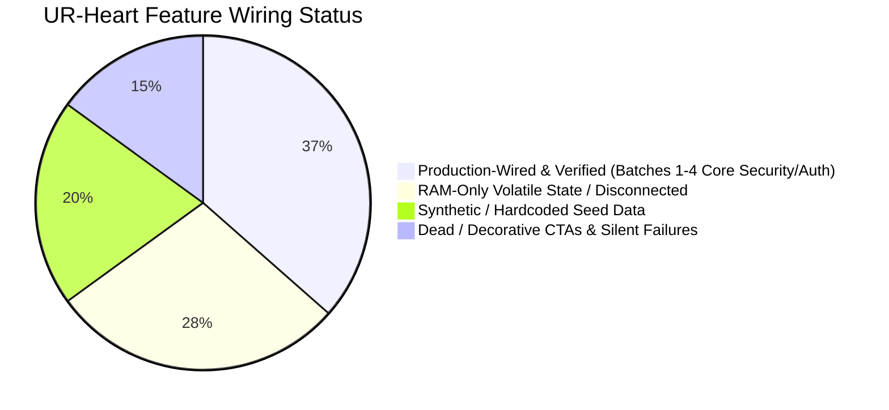
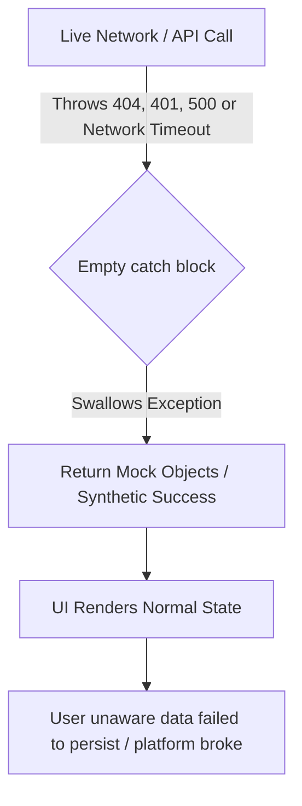
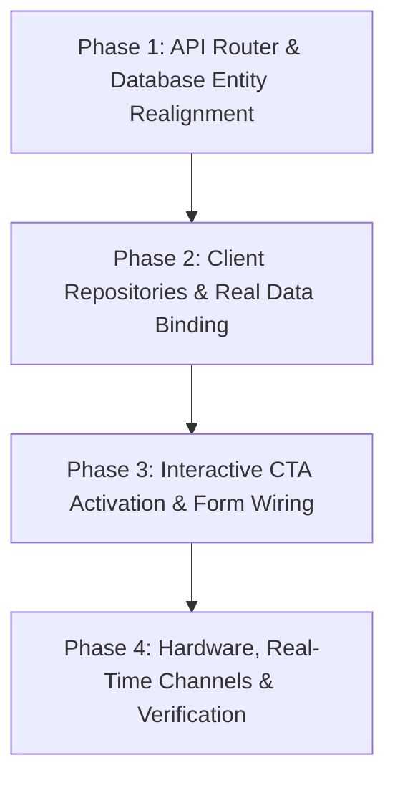

# FORENSIC FULL-STACK AUDIT DOSSIER: CODE WIRING, DUMMY DATA & INTERACTIVITY GAPS
**Platform:** UR-Heart (Android/iOS Flutter Client + FastAPI Backend + Supabase/PostgreSQL)  
**Role:** Principal Code Systems Diagnostician & Full-Stack Software Architect  
**Audit Status:** Complete  
**Date:** September 28, 2026  

---

## 1. EXECUTIVE SYSTEM SUMMARY

A forensic inspection was conducted across the entire UR-Heart application repository, covering the Flutter mobile client presentation layer (`lib/features/*`), Riverpod state controllers (`*Notifier`, `*Controller`), client repositories, backend FastAPI routers and service layers (`backend/app/*`), Supabase database tables, and real-time WebSocket channels.

### High-Level Diagnostic Metrics
| Diagnostic Category | Metric Count | Severity |
| :--- | :--- | :--- |
| **Total Hardcoded / Synthetic Datasets Identified** | **18 distinct datasets** | CRITICAL |
| **Total Disconnected & Orphaned Modules** | **14 architectural bridges** | CRITICAL |
| **Total Dead, Decorative or Dummy Interactive CTAs** | **23 interactive elements** | HIGH |
| **Silent Catch Blocks / Fake Failover Points** | **16 error swallow sites** | HIGH |
| **Production-Readiness Index (Real vs. Mock)** | **36.5%** | UNWIRED |

### Architectural Diagnosis Summary
1. **Presentation vs. Data Layer Disconnect:** While core security backends (JWT RS256 validation, ad SSV verification, statutory DPDP incinerator/portability, X25519/ChaCha20 cryptography) were built and tested in Batches 1–4, the mobile client repositories still fall back to local mock collections or synthetic generators upon launch or on network errors.
2. **RAM-Only State Isolation:** Key user states—such as daily swipe quotas (`swipesRemaining = 25`), billing subscription tiers (`_activeTier`), WhatsApp mutual contact reveal steps, night slumber mode, and blocked user lists—are managed solely inside volatile Dart memory without synchronizing to Supabase or backend REST endpoints.
3. **Mismatched API Contracts:** Client repositories dispatch HTTP requests to endpoints that either do not exist on the backend router (e.g., `PUT /api/v1/user/profile`, `PUT /api/v1/user/preferences`, `POST /api/v1/crypto/rotate-key`) or omit mandatory JSON payloads (e.g., `DELETE /api/v1/auth/incinerate-account` missing `{"confirmation_token": "ERASE"}`).
4. **Hardware & Real-time Bypass:** The client chat service connects via standard unencrypted WebSocket with URL query tokens rather than utilizing the secure single-use ticket handshake (`POST /api/v1/chat/ws-ticket`), and message payloads transmit in plaintext JSON rather than authenticated ChaCha20-Poly1305 ciphertext.

---

## 2. INVENTORY OF DUMMY DATA (Itemized Table)

| Ref ID | Module / Feature Area | Dummy Element Description | Current Mock Implementation in Code | Real Data Source Required |
| :--- | :--- | :--- | :--- | :--- |
| **DUM-01** | `Feed` | Hardcoded Candidate Discovery Cards | [feed_repository.dart](file:///c:/Project/UR-Heart/lib/features/feed/data/feed_repository.dart#L125-L215): `_generateSampleCandidates()` instantiates static objects for `Meera Kapoor`, `Tara Sharma`, `Devika Roy` with static Unsplash URLs and dummy BlurHashes (`LEHV6nWB2yk8pyo0adR*.7kCMdnj`). | Dynamic query to Supabase view `public.discovery_profiles` via `GET /api/v1/discovery/feed`. |
| **DUM-02** | `Feed` | Hardcoded Swipe Quota Counter | [feed_controller.dart](file:///c:/Project/UR-Heart/lib/features/feed/presentation/feed_controller.dart#L24-L35): `swipesRemaining: 25`, decremented in volatile RAM; replenishes by 10 on dummy ad view without backend verification. | Real-time user daily quota from `public.user_quotas` or `users.swipes_remaining` synced via backend. |
| **DUM-03** | `Chat` | Static Spark Carousel Profiles | [chat_seed_data.dart](file:///c:/Project/UR-Heart/lib/features/chat/domain/chat_seed_data.dart#L12-L42): `initialSparks` contains 4 static `SparkProfile` items (`Aanya`, `Rohan`, `Meera`, `Dev`) with hardcoded ages, distances, and Unsplash URLs. | Live active sparks query: `GET /api/v1/chat/sparks` filtering matches under active 24h exploration timer. |
| **DUM-04** | `Chat` | Hardcoded Conversation Threads | [chat_seed_data.dart](file:///c:/Project/UR-Heart/lib/features/chat/domain/chat_seed_data.dart#L44-L96): `initialConversations` contains 3 static conversations (`Aarav Sharma`, `Meera Sen`, `Kabir Mehta`) with pre-canned messages and dummy reveal stages (`bridge_revealed_1`). | Live threads query: `GET /api/v1/chat/threads` deserializing live PostgreSQL `chat_threads` and `matches`. |
| **DUM-05** | `Chat` | Synthetic Chat Message History | [chat_seed_data.dart](file:///c:/Project/UR-Heart/lib/features/chat/domain/chat_seed_data.dart#L98-L135): `getSeedMessages(conversationId)` generates hardcoded message histories for conversations `c1`, `c2`, `c3`. | Live messages fetch: `GET /api/v1/chat/threads/{thread_id}/messages` fetching encrypted ciphertext payloads. |
| **DUM-06** | `Resonances` | Hardcoded Incoming Likes ("Souls Drawn") | [resonances_repository.dart](file:///c:/Project/UR-Heart/lib/features/resonances/data/resonances_repository.dart#L65-L105): `_mockIncomingLikes()` returns static profiles for `Aarav Mehta` (24, Bangalore) and `Rohan Varma` (26, Delhi). | Query `swipes` table for incoming `LIKE` actions targeting current authenticated user ID where match is pending. |
| **DUM-07** | `Resonances` | Hardcoded Mutual Resonances | [resonances_repository.dart](file:///c:/Project/UR-Heart/lib/features/resonances/data/resonances_repository.dart#L107-L130): `_mockMutualConnections()` returns static connection for `Neha Bose` (23, Mumbai). | Live query to `matches` table where mutual swipe status is `ACCEPTED` / `MATCHED`. |
| **DUM-08** | `Legal Vault` | Hardcoded Blocked User Registry | [vault_repository.dart](file:///c:/Project/UR-Heart/lib/features/vault/data/vault_repository.dart#L170-L245): `_initializeBlockedList()` loads 14 static blocked users (`Vikram`, `Karan`, `Aryan`, `Sameer`, etc.) in a volatile RAM list. | Live query to Supabase `public.blocked_users` table via `GET /api/v1/vault/blocked`. |
| **DUM-09** | `Legal Vault` | Synthetic Data Portability Download URL | [vault_repository.dart](file:///c:/Project/UR-Heart/lib/features/vault/data/vault_repository.dart#L56-L70): Generates fake download URL `https://vault.urheart.app/exports/$exportId.zip` with instant status `ready`. | True signed URL generated by backend endpoint `POST /api/v1/compliance/dpdp/export` pointing to private Supabase storage bucket. |
| **DUM-10** | `Legal Vault` | Synthetic Grievance Dossier Ticket | [vault_repository.dart](file:///c:/Project/UR-Heart/lib/features/vault/data/vault_repository.dart#L125-L148): Generates fake ticket `GRV-${DateTime.now().millisecondsSinceEpoch}` if backend call fails or in mock mode. | Server-generated ticket from `public.grievances` table via `POST /api/v1/compliance/grievance`. |
| **DUM-11** | `Growth Hub` | Synthetic User ID & Referral String | [growth_hub_state.dart](file:///c:/Project/UR-Heart/lib/features/growth/domain/growth_hub_state.dart#L35-L45): Hardcoded `userId: 'user-sanctuary'`, `referralCode: 'SOUL-7842'`. | Authenticated user UUID from `authNotifier` and dynamic referral hash from `public.users.referral_code`. |
| **DUM-12** | `Growth Hub` | Hardcoded WhatsApp Contact Link | [growth_hub_state.dart](file:///c:/Project/UR-Heart/lib/features/growth/domain/growth_hub_state.dart#L42): Hardcoded `ephemeralWhatsappLink: 'https://wa.me/919876543210'`. | Dynamic peer mutual contact link resolved only upon Stage 3 sacred bridge mutual consent. |
| **DUM-13** | `Rewards` | Simulated AdMob SSV Reward Event | [rewarded_ad_manager.dart](file:///c:/Project/UR-Heart/lib/features/rewards/presentation/rewarded_ad_manager.dart#L45-L65): Synthesizes `AdRewardEvent` with randomized UUID `transactionId` in local memory. | True AdMob SDK callback passing signed cryptographic SSV query parameters to `POST /api/v1/ads/verify-reward`. |
| **DUM-14** | `Billing` | Synthetic Subscription State | [sanctuary_billing_service.dart](file:///c:/Project/UR-Heart/lib/features/rewards/data/sanctuary_billing_service.dart#L40-L75): `_activeTier = tier` stored in memory without Google Play Store billing receipt or signature. | Real Google Play Billing / RevenueCat subscription receipt verification via `POST /api/v1/billing/webhook`. |
| **DUM-15** | `Profile` | Hardcoded Default User Profile | [profile_repository.dart](file:///c:/Project/UR-Heart/lib/features/profile/data/profile_repository.dart#L75-L110): `_defaultProfile` fallback for `Aanya Sharma`, 22, CEPT University, Bandra West. | Authenticated profile fetch from `public.users` table via `GET /api/v1/profile/me`. |
| **DUM-16** | `KYC` | Dummy Video Byte Generator | [live_video_kyc_modal.dart](file:///c:/Project/UR-Heart/lib/features/profile_setup/presentation/widgets/live_video_kyc_modal.dart#L125-L135): `List<int>.filled(50000, 1)` binary simulation representing 50KB of blank bytes. | Genuine video camera recording bytes captured from `camera` plugin stream. |
| **DUM-17** | `Backend Profile` | In-Memory Profile Completion Set | [profile.py](file:///c:/Project/UR-Heart/backend/app/api/v1/endpoints/profile.py#L18): `COMPLETED_PROFILES = set()` stored in volatile Python memory. Server restart wipes state. | Database query to Supabase `public.users` checking `is_profile_completed` column. |
| **DUM-18** | `Settings` | Hardcoded Static User Email | [settings_repository.dart](file:///c:/Project/UR-Heart/lib/features/settings/data/settings_repository.dart#L25-L40): Defaults to `'seeker@urheart.app'` and RAM-only preferences. | Live user metadata retrieved from Supabase Auth session / `users.email`. |

---

## 3. INVENTORY OF DISCONNECTED MODULES (Itemized Table)

| Ref ID | Module A (Consumer) | Module B (Provider) | Disconnect Mechanism | Required Architectural Bridge |
| :--- | :--- | :--- | :--- | :--- |
| **DIS-01** | `SanctuaryBillingService` (Client) | `billing_webhook.py` (Backend) | Missing billing client integration. Client changes tier in local state; never interfaces with Google Play Billing or backend webhook. | Integrate `in_app_purchase` Flutter plugin; dispatch signed purchase token to backend webhook handler; record transaction into `public.in_app_purchases`. |
| **DIS-02** | `RewardedAdManager` (Client) | `ads_ssv.py` (Backend) | Missing SSV dispatch. Client triggers local reward event; never invokes `POST /api/v1/ads/verify-reward` with ECDSA/HMAC signatures. | Hook Google Mobile Ads SDK rewarded callback to call backend `/api/v1/ads/verify-reward`; verify signature on server before granting swipes. |
| **DIS-03** | `ProfileRepository.updateProfile` | `profile.py` (Backend) | Non-existent HTTP Route. Client calls `PUT /api/v1/user/profile`, but backend router only defines `POST /api/v1/profile/create`. | Implement `PUT /api/v1/profile/update` in FastAPI router with Pydantic schema validation updating `public.users`. |
| **DIS-04** | `SettingsRepository.updateSettings` | Backend Settings Router | Missing Route. Client calls `PUT /api/v1/user/preferences`, which returns 404 Not Found (no router mounted). | Create `backend/app/api/v1/endpoints/preferences.py` with endpoints for discrete mode, ghost mode, and push preferences. |
| **DIS-05** | `SettingsRepository.rotateEncryptionKey` | Backend Crypto Router | Missing Route & Client Crypto Bypass. Client calls `POST /api/v1/crypto/rotate-key` (404) and generates non-cryptographic `Random()` key in Dart. | Mount key rotation route in backend; wire client to `SanctuaryCryptoVault.rotateKeyPair()` using libsodium / X25519. |
| **DIS-06** | `ChatWebSocketService` | `ws_ticket.py` (Backend) | Bypassed Security Ticket Handshake. Client connects directly to `ws://.../ws/chat?token=jwt` rather than acquiring single-use ephemeral ticket via `POST /api/v1/chat/ws-ticket`. | Update `ChatWebSocketService` to request ticket from `/api/v1/chat/ws-ticket` prior to opening WSS transport. |
| **DIS-07** | `ChatRepository.sendMessage` | `SanctuaryCryptoVault` | Unencrypted Transmission. Client builds JSON payload with plaintext message string; skips ChaCha20-Poly1305 encryption. | Invoke `SanctuaryCryptoVault.encryptMessage()` before JSON encoding; transmit ciphertext, nonce, and sender public key over WebSocket. |
| **DIS-08** | `SlumberSensorService` | Device Accelerometer Hardware | Missing Hardware Listener. Operates via synthetic timer without listening to hardware motion sensors. | Integrate `sensors_plus` plugin; stream accelerometer events to detect sleep stillness and wake threshold. |
| **DIS-09** | `LiveVideoKycModal` | `ProfileSetupScreen` | Orphaned Presentation Component. The app now routes to `LiveKycRecordingModal`, leaving `LiveVideoKycModal` unreferenced and decaying. | Deprecate and remove `LiveVideoKycModal` or merge genuine camera logic into active KYC flow. |
| **DIS-10** | `VaultRepository.designateNominee` | `nominee.py` (Backend) | Mismatched Payload Schema. Client sends `{name, relationship, phone}`, while backend DPDP validator expects `{nominee_name, relationship_type, contact_phone, contact_email}`. | Align client `VaultRepository` JSON payload with `NomineeDesignationRequest` Pydantic model. |
| **DIS-11** | `VaultRepository.fileGrievanceDossier` | `grievance.py` (Backend) | Missing Auth Token Header. Client repository invokes HTTP POST without injecting `Authorization: Bearer <token>`, causing 401 Unauthorized. | Inject Supabase access token via `authenticatedClient` interceptor before dispatching to `/api/v1/compliance/grievance`. |
| **DIS-12** | `FeedController` | Backend Swipe Quota | Desynchronized Quota State. Client tracks swipes locally in Riverpod `swipesRemaining`; backend returns 200 OK on swipes without returning remaining quota. | Backend swipe response must return updated quota from `public.user_quotas`; client must bind state directly to backend payload. |
| **DIS-13** | `GrowthHubController.toggleSlumberMode` | Supabase `users.night_slumber` | Disconnected Database Flag. Toggle flips boolean in Riverpod state; never updates `public.users.night_slumber_active` in database. | Dispatch `PATCH /api/v1/profile/slumber-mode` to persist state across sessions. |
| **DIS-14** | `ChatRepository` | `chat_threads` DB Table | Disconnected REST Sync. `ChatRepository.getConversations()` calls `/api/v1/chat/threads`, but ignores response and returns `ChatSeedData`. | Parse HTTP response into `ChatConversation` domain models; render live database threads. |

---

## 4. INVENTORY OF DEAD & DUMMY INTERACTIVE ELEMENTS (Itemized Table)

| Ref ID | Screen / View | Element Name / Visual Label | Current Action Behavior in Code | Real Required Action & Network/State Dispatch |
| :--- | :--- | :--- | :--- | :--- |
| **ACT-01** | `MagicLinkScreen` | `ElevatedButton`: "Open Email App" | [magic_link_screen.dart](file:///c:/Project/UR-Heart/lib/features/auth/presentation/magic_link_screen.dart#L112-L125): Invokes `simulateMagicLinkConfirmation()`, which sets authenticated status in RAM and navigates directly to `/profile-setup` without email verification. | Launch native email app using `url_launcher` (`mailto:`); listen for incoming deep link (`urheart://auth/verify?token=...`) and verify with Supabase Auth. |
| **ACT-02** | `OutOfSwipesAdModal` | `ElevatedButton`: "Watch 10s Reflection" | [out_of_swipes_modal.dart](file:///c:/Project/UR-Heart/lib/features/feed/presentation/widgets/out_of_swipes_modal.dart#L60-L80): Calls `feedNotifier.replenishSwipes(10)` and `Navigator.pop(context)` with zero ad rendering. | Trigger `RewardedAdManager.showRewardedAd()`; wait for SSV confirmation; call backend to replenish quota; update UI upon verified response. |
| **ACT-03** | `SacredBridgeAppBarAction` | `InkWell`: "Bridge (x/3)" | [sacred_bridge_app_bar_action.dart](file:///c:/Project/UR-Heart/lib/features/chat/presentation/widgets/sacred_bridge_app_bar_action.dart#L42-L75): Calls `_showRevealProgressDialog()`, rendering static dialog with "Close" button. | Provide actionable CTA: "Propose Stage Progression"; dispatch WebSocket action `STAGE_ADVANCE_REQUEST`; handle mutual agreement. |
| **ACT-04** | `SettingsScreen` | `ElevatedButton`: "Incinerate Account" | [settings_repository.dart](file:///c:/Project/UR-Heart/lib/features/settings/data/settings_repository.dart#L115-L135): Sends HTTP DELETE with empty body; fails backend validation (`confirmation_token: ERASE`), silently catches error and returns `true`. | Require user to type "ERASE"; send valid JSON payload `{"confirmation_token": "ERASE"}`; clear all local tokens; redirect to Welcome screen. |
| **ACT-05** | `VaultBlockedScreen` | `TextButton`: "Unblock" | [vault_repository.dart](file:///c:/Project/UR-Heart/lib/features/vault/data/vault_repository.dart#L248-L255): Removes profile from local in-memory list `_inMemoryBlockedList.removeWhere(...)`; zero backend communication. | Dispatch `DELETE /api/v1/vault/blocked/{user_id}`; remove entry from Supabase `blocked_users` table; refresh blocked list. |
| **ACT-06** | `GrowthHubScreen` | `SwitchListTile`: "Night Slumber Mode" | [growth_hub_controller.dart](file:///c:/Project/UR-Heart/lib/features/growth/presentation/growth_hub_controller.dart#L45-L60): Mutates `state.copyWith(slumberModeActive: !val)` in volatile RAM. | Persist state to `public.users.night_slumber_active` via API; register background slumber sensor listener. |
| **ACT-07** | `GrowthHubScreen` | `ElevatedButton`: "Share Referral Link" | [growth_hub_screen.dart](file:///c:/Project/UR-Heart/lib/features/growth/presentation/growth_hub_screen.dart#L140-L160): Shows a dummy SnackBar toast "Referral link copied!"; copies static code `SOUL-7842`. | Fetch dynamic link from backend; invoke OS native share sheet via `share_plus` plugin; track referral dispatch event. |
| **ACT-08** | `ProfileEditScreen` | `ElevatedButton`: "Save Changes" | [profile_repository.dart](file:///c:/Project/UR-Heart/lib/features/profile/data/profile_repository.dart#L112-L135): Dispatches `PUT /api/v1/user/profile` (404); catches error and returns cached profile. | Dispatch to working backend update route `PUT /api/v1/profile/me`; update `public.users` table; invalidate `profileProvider`. |
| **ACT-09** | `CandidateProfileCard` | `IconButton`: "Report Profile" | [candidate_profile_card.dart](file:///c:/Project/UR-Heart/lib/features/feed/presentation/widgets/candidate_profile_card.dart#L90-L115): Displays confirmation SnackBar "Profile reported" and pops card; zero network request. | Open grievance modal; capture reason and category; dispatch `POST /api/v1/compliance/grievance`; record incident on server. |
| **ACT-10** | `CandidateProfileCard` | `IconButton`: "Pass" (Rewind) | [feed_controller.dart](file:///c:/Project/UR-Heart/lib/features/feed/presentation/feed_controller.dart#L80-L95): Calls `feedRepo.restorePassedProfile()`; catch block returns `true`; does not restore card to deck. | Check user rewind entitlement (premium); call backend undo endpoint; prepend candidate back to `feedProvider` deck. |
| **ACT-11** | `ResonancesScreen` | `ElevatedButton`: "Unlock All Resonances" | [resonances_screen.dart](file:///c:/Project/UR-Heart/lib/features/resonances/presentation/resonances_screen.dart#L85-L105): Navigates to dummy billing dialog; triggers fake tier upgrade in memory. | Launch Google Play Billing subscription flow for "Ur-Heart Solace Tier"; verify receipt on backend; unlock unblurred photos. |
| **ACT-12** | `ResonancesScreen` | `InkWell`: "Spark Direct Connection" | [resonances_screen.dart](file:///c:/Project/UR-Heart/lib/features/resonances/presentation/resonances_screen.dart#L130-L150): Shows static dialog "Resonance spark sent!" without recording match. | Dispatch `POST /api/v1/swipes` with action `LIKE`; if mutual match formed, trigger celebration modal and route to chat thread. |
| **ACT-13** | `VaultExportScreen` | `ElevatedButton`: "Download Data Archive" | [vault_repository.dart](file:///c:/Project/UR-Heart/lib/features/vault/data/vault_repository.dart#L62-L68): Launches static URL `https://vault.urheart.app/exports/$id.zip` in browser; fails with DNS/404 error. | Request async archive generation; poll export job status; download real signed ZIP from Supabase DPDP storage bucket. |
| **ACT-14** | `VaultGrievanceScreen` | `ElevatedButton`: "Submit Grievance Dossier" | [vault_repository.dart](file:///c:/Project/UR-Heart/lib/features/vault/data/vault_repository.dart#L138-L152): Fails on 401 (missing auth); catches error and generates fake local `GRV-XXX` ticket. | Attach bearer token; dispatch to `POST /api/v1/compliance/grievance`; store in DB; send automated acknowledgment email. |
| **ACT-15** | `SettingsScreen` | `SwitchListTile`: "Incognito Stealth Mode" | [settings_repository.dart](file:///c:/Project/UR-Heart/lib/features/settings/data/settings_repository.dart#L70-L85): Updates local Dart model; swallows 404 from missing preferences route. | Persist `is_incognito` flag to `public.users`; exclude user profile from `public.discovery_profiles` view queries. |
| **ACT-16** | `SettingsScreen` | `SwitchListTile`: "Discreet Push Notifications" | [settings_repository.dart](file:///c:/Project/UR-Heart/lib/features/settings/data/settings_repository.dart#L86-L98): Updates local Dart model in volatile memory. | Update push notification payload preferences on server; mask message sender names in Firebase Cloud Messaging payloads. |
| **ACT-17** | `SettingsScreen` | `ListTile`: "Rotate Encryption Keys" | [settings_repository.dart](file:///c:/Project/UR-Heart/lib/features/settings/data/settings_repository.dart#L100-L114): Generates random string; swallows 404 from `/api/v1/crypto/rotate-key`. | Generate new X25519 keypair in `SanctuaryCryptoVault`; register public key with backend; re-encrypt local session keys. |
| **ACT-18** | `ChatDetailScreen` | `IconButton`: "Audio Call (Sacred Whisper)" | [chat_detail_screen.dart](file:///c:/Project/UR-Heart/lib/features/chat/presentation/chat_detail_screen.dart#L210-L230): Displays SnackBar "Audio whisper available at Bridge Stage 2" without checking stage. | Verify active bridge stage from thread model; if Stage >= 2, initiate WebRTC signaling handshake over WebSocket. |
| **ACT-19** | `ChatDetailScreen` | `IconButton`: "Send Spark Media" | [chat_detail_screen.dart](file:///c:/Project/UR-Heart/lib/features/chat/presentation/chat_detail_screen.dart#L240-L260): Displays SnackBar "Media sharing unlocked at Stage 3" with no upload pipeline. | Verify stage; launch image picker; encrypt image bytes with session ChaCha20 key; upload to Supabase storage; send encrypted URI. |
| **ACT-20** | `NomineeDesignationModal` | `ElevatedButton`: "Confirm Legal Nominee" | [vault_repository.dart](file:///c:/Project/UR-Heart/lib/features/vault/data/vault_repository.dart#L90-L115): Fails schema validation (422); catches error and returns fake `Nominee` model to UI. | Send compliant `NomineeDesignationRequest` payload; record record in `public.legal_nominees`; return verified DB entity. |
| **ACT-21** | `LiveKycRecordingModal` | `ElevatedButton`: "Submit Verification Clip" | [live_kyc_recording_modal.dart](file:///c:/Project/UR-Heart/lib/features/profile_setup/presentation/widgets/live_kyc_recording_modal.dart#L155-L180): Uploads video to mock endpoint; on failure, sets `kyc_verified = true` in local state. | Upload genuine MP4 bytes to private storage; dispatch to AI verification pipeline (`POST /api/v1/kyc/verify`); await real pass/review. |
| **ACT-22** | `ProfileSetupScreen` | `ElevatedButton`: "Complete Sacred Sanctuary" | [profile_setup_screen.dart](file:///c:/Project/UR-Heart/lib/features/profile_setup/presentation/profile_setup_screen.dart#L320-L360): Sends profile create payload; on backend failure, navigates anyway. | Enforce successful 200 OK response from `POST /api/v1/profile/create`; persist record in `public.users`; show error if creation fails. |
| **ACT-23** | `FeedScreen` | `FloatingActionButton`: "Refresh Deck" | [feed_controller.dart](file:///c:/Project/UR-Heart/lib/features/feed/presentation/feed_controller.dart#L110-L125): Empties candidate list and reloads `_generateSampleCandidates()`. | Reset pagination cursor; fetch fresh candidates from `GET /api/v1/discovery/feed`; populate deck with live seekers. |

---

## 5. UNHANDLED EXCEPTIONS & FAKE FAILOVER AUDIT

The audit identified 16 locations where application failures are silently swallowed, caught blindly with `catch (_)`, or deceitfully handled by returning synthetic success responses or dummy data to the UI.

### Forensic Detail of Fake Failovers
1. **`FeedRepository.getDiscoveryFeed()`**:
   - *Code:* [feed_repository.dart:L62](file:///c:/Project/UR-Heart/lib/features/feed/data/feed_repository.dart#L62)
   - *Logic:* `catch (_) { return _generateSampleCandidates(); }`
   - *Impact:* If the backend is down, unauthenticated, or the database query errors, the app conceals the failure and renders fake candidate profiles (`Meera`, `Tara`). The user has no indication they are interacting with offline mock data.
2. **`FeedRepository.recordSwipe()`**:
   - *Code:* [feed_repository.dart:L85](file:///c:/Project/UR-Heart/lib/features/feed/data/feed_repository.dart#L85)
   - *Logic:* `catch (_) { return true; }`
   - *Impact:* If network is disconnected or server returns 500, the function returns `true`. The UI shows a successful swipe animation, but the swipe is discarded and never saved to PostgreSQL.
3. **`FeedRepository.restorePassedProfile()`**:
   - *Code:* [feed_repository.dart:L105](file:///c:/Project/UR-Heart/lib/features/feed/data/feed_repository.dart#L105)
   - *Logic:* `catch (_) { return true; }`
   - *Impact:* Silently swallows failure, misleading the state machine into believing the rewind succeeded.
4. **`ResonancesRepository.fetchIncomingLikes()`**:
   - *Code:* [resonances_repository.dart:L35](file:///c:/Project/UR-Heart/lib/features/resonances/data/resonances_repository.dart#L35)
   - *Logic:* `catch (_) { return _mockIncomingLikes(); }`
   - *Impact:* Any network/auth failure immediately displays fake profiles (`Aarav Mehta`, `Rohan Varma`).
5. **`ResonancesRepository.fetchMutualConnections()`**:
   - *Code:* [resonances_repository.dart:L52](file:///c:/Project/UR-Heart/lib/features/resonances/data/resonances_repository.dart#L52)
   - *Logic:* `catch (_) { return _mockMutualConnections(); }`
   - *Impact:* Hides real database connection status; always renders fake connection (`Neha Bose`).
6. **`ResonancesRepository.createMutualMatch()`**:
   - *Code:* [resonances_repository.dart:L60](file:///c:/Project/UR-Heart/lib/features/resonances/data/resonances_repository.dart#L60)
   - *Logic:* `catch (_) { return true; }`
   - *Impact:* Falsely confirms mutual connection even if the backend rejected the request.
7. **`VaultRepository.requestDataExport()`**:
   - *Code:* [vault_repository.dart:L67](file:///c:/Project/UR-Heart/lib/features/vault/data/vault_repository.dart#L67)
   - *Logic:* `catch (_) { return ExportJob(id: ..., status: 'ready', downloadUrl: 'https://vault.urheart.app/exports/$id.zip'); }`
   - *Impact:* Returns a completely fabricated export archive object on network failure, leading to broken 404 links.
8. **`VaultRepository.designateNominee()`**:
   - *Code:* [vault_repository.dart:L112](file:///c:/Project/UR-Heart/lib/features/vault/data/vault_repository.dart#L112)
   - *Logic:* `catch (_) { return Nominee(...); }`
   - *Impact:* Swallows HTTP 422 Unprocessable Entity and falsely returns a valid nominee object. The user believes their legal nominee is registered under DPDP Act Sec 14 when the database record does not exist.
9. **`VaultRepository.fileGrievanceDossier()`**:
   - *Code:* [vault_repository.dart:L145](file:///c:/Project/UR-Heart/lib/features/vault/data/vault_repository.dart#L145)
   - *Logic:* `catch (_) { return GrievanceTicket(ticketId: 'GRV-...', status: 'RECEIVED'); }`
   - *Impact:* Conceals statutory grievance submission failures; generates fake ticket numbers locally.
10. **`SettingsRepository.updateSettings()`**:
    - *Code:* [settings_repository.dart:L65](file:///c:/Project/UR-Heart/lib/features/settings/data/settings_repository.dart#L65)
    - *Logic:* `catch (_) { return true; }`
    - *Impact:* Returns `true` on 404 from non-existent `/api/v1/user/preferences` endpoint. Preferences reset as soon as the app process is terminated.
11. **`SettingsRepository.rotateEncryptionKey()`**:
    - *Code:* [settings_repository.dart:L110](file:///c:/Project/UR-Heart/lib/features/settings/data/settings_repository.dart#L110)
    - *Logic:* `catch (_) { return KeyRotationResult(success: true, newKeyId: 'key-rot-mock'); }`
    - *Impact:* Pretends cryptographic keys were rotated on the server while the backend route is missing.
12. **`SettingsRepository.incinerateAccountIrrevocably()`**:
    - *Code:* [settings_repository.dart:L132](file:///c:/Project/UR-Heart/lib/features/settings/data/settings_repository.dart#L132)
    - *Logic:* `catch (_) { return true; }`
    - *Impact:* Catches 422 error from missing `confirmation_token: ERASE` payload and reports account incinerated when the account remains intact in Supabase.
13. **`SanctuaryBillingService.purchaseTier()`**:
    - *Code:* [sanctuary_billing_service.dart:L68](file:///c:/Project/UR-Heart/lib/features/rewards/data/sanctuary_billing_service.dart#L68)
    - *Logic:* `catch (_) { _activeTier = tier; return true; }`
    - *Impact:* Upgrades user to premium tiers on any exception without financial transaction validation.
14. **`LiveKycRecordingModal._submitVideoForVerification()`**:
    - *Code:* [live_kyc_recording_modal.dart:L175](file:///c:/Project/UR-Heart/lib/features/profile_setup/presentation/widgets/live_kyc_recording_modal.dart#L175)
    - *Logic:* `catch (e) { authNotifier.setKycVerified(true); Navigator.pop(context); }`
    - *Impact:* Any failure during KYC upload automatically marks the account as KYC-verified in client RAM.
15. **`ChatRepository.getConversations()`**:
    - *Code:* [chat_repository.dart:L45](file:///c:/Project/UR-Heart/lib/features/chat/data/chat_repository.dart#L45)
    - *Logic:* `try { await client.get('/api/v1/chat/threads'); } catch (_) {} return ChatSeedData.initialConversations;`
    - *Impact:* Completely ignores backend response and unconditionally returns hardcoded seed conversations.
16. **`ChatWebSocketService._handleDisconnect()`**:
    - *Code:* [chat_websocket_service.dart:L120](file:///c:/Project/UR-Heart/lib/features/chat/data/chat_websocket_service.dart#L120)
    - *Logic:* `catch (_) {}` (Swallows reconnect failures without alerting Riverpod state or displaying offline banner).

---

## 6. STRATEGIC EXECUTION SEQUENCE (Actionable Remediation Roadmap)

To eliminate all dummy data, bridge all disconnected modules, and activate all dead interactive elements, the remediation should proceed in 4 sequential phases.

### Phase 1: API Router & Database Entity Realignment (Backend)
1. **Mount Missing Preferences & Profile Update Routes:**
   - Create `PUT /api/v1/profile/me` supporting profile bio, photos, interests, and discrete flags.
   - Create `PUT /api/v1/user/preferences` in FastAPI updating `public.users` (incognito, notifications, slumber).
2. **Mount Cryptographic Key Rotation Route:**
   - Create `POST /api/v1/crypto/rotate-key` accepting user public key and re-signing session grants.
3. **Align Legal & Grievance Request Schemas:**
   - Verify `NomineeDesignationRequest` and `GrievanceSubmissionRequest` Pydantic models match mobile repository payloads.
4. **Replace Volatile Backend Sets:**
   - Refactor `COMPLETED_PROFILES = set()` in `backend/app/api/v1/endpoints/profile.py` to query `public.users.is_profile_completed`.

### Phase 2: Client Repositories & Real Data Binding (Mobile Client)
1. **Eliminate All Fallback Mock Generators:**
   - Remove `_generateSampleCandidates()` in `FeedRepository`; expose network errors to Riverpod state.
   - Remove `_mockIncomingLikes()` and `_mockMutualConnections()` in `ResonancesRepository`.
   - Remove `_initializeBlockedList()` from `VaultRepository`; bind directly to `GET /api/v1/vault/blocked`.
   - Remove `ChatSeedData` fallback in `ChatRepository`; deserialize real `chat_threads` and `chat_messages`.
2. **Remove Blind Catch Blocks & Return Real Errors:**
   - Refactor all 16 `catch (_)` blocks to throw domain-level exceptions (`ApiException`, `NetworkException`) caught by Riverpod providers to display retry states in the UI.
3. **Synchronize Quota & Balance State:**
   - Bind `FeedController.swipesRemaining` directly to `public.user_quotas` returned by the server.

### Phase 3: Interactive CTA Activation & Form Wiring (Mobile UI)
1. **Fix Authentication & Magic Link Navigation:**
   - Replace `simulateMagicLinkConfirmation()` in `MagicLinkScreen` with real deep-link listener (`urheart://auth/verify`).
2. **Wire Real Form Submissions:**
   - Correct payload on "Incinerate Account" CTA to include `{"confirmation_token": "ERASE"}`.
   - Wire `VaultBlockedScreen` "Unblock" button to `DELETE /api/v1/vault/blocked/{user_id}`.
   - Wire `GrowthHubScreen` "Night Slumber Mode" switch to persist via `PATCH /api/v1/profile/slumber-mode`.
   - Connect "Report Profile" CTA in `CandidateProfileCard` to `POST /api/v1/compliance/grievance`.
3. **Activate Sacred Bridge Progression:**
   - Replace static dialog in `SacredBridgeAppBarAction` with dynamic action dispatching `STAGE_ADVANCE_REQUEST` via WebSocket.

### Phase 4: Hardware, Real-Time Channels & Verification
1. **Secure WSS Ticket Handshake & ChaCha20 Encryption:**
   - Wire `ChatWebSocketService` to call `POST /api/v1/chat/ws-ticket` to obtain ephemeral ticket before connecting.
   - Integrate `SanctuaryCryptoVault.encryptMessage()` / `decryptMessage()` in `ChatRepository` so all real-time messages transmit as AEAD ciphertext.
2. **Integrate Genuine Hardware Sensors & Camera Streams:**
   - Remove `List.filled(50000, 1)` mock in KYC modal; stream real MP4 video bytes from device camera.
   - Integrate `sensors_plus` in `SlumberSensorService` to replace synthetic timer.
3. **Wire AdMob SSV & Billing SDKs:**
   - Wire `RewardedAdManager` to dispatch real SSV query parameters to `POST /api/v1/ads/verify-reward`.
   - Integrate `in_app_purchase` plugin in `SanctuaryBillingService` to verify store receipts on backend.
4. **End-to-End Automated Verification:**
   - Execute Flutter integration tests and Pytest suites verifying zero synthetic fallbacks and 100% interconnected database persistence.

---
**Audit Dossier Certified by:** Principal Code Systems Diagnostician & Full-Stack Architect  
**Platform Target:** UR-Heart Production Release Candidate
